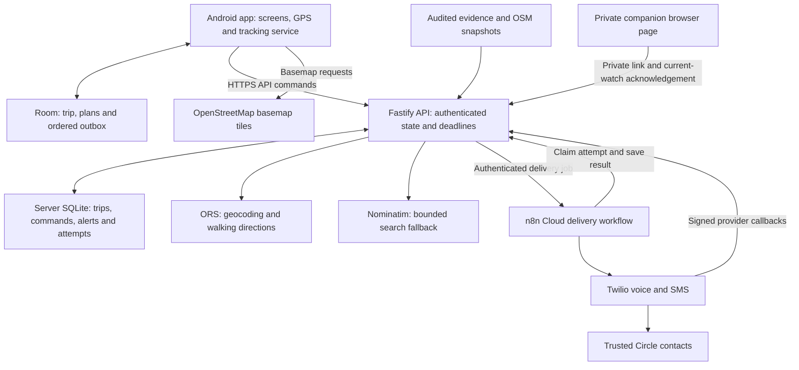
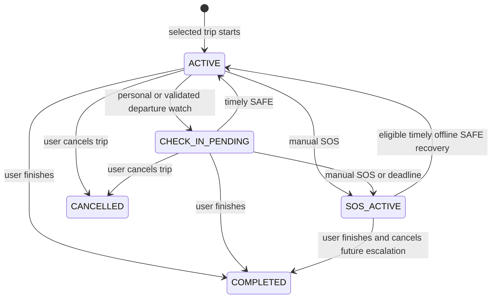
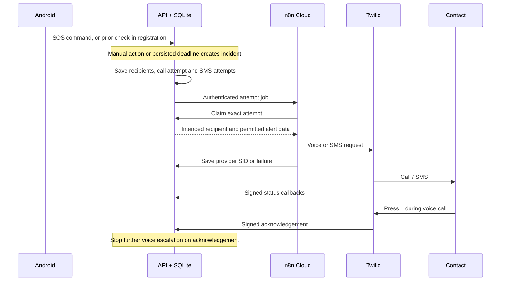

# SheShield — hackathon master guide

Prepared on **3 October 2026** from the current Android application, API, Cloud workflow, evidence files and recorded validation results.

**Purpose:** understand the product, demonstrate it clearly, explain the engineering and answer difficult questions without making unsupported claims.

This guide describes the implementation inspected on that date. It is a documentation snapshot, not a new live delivery test. Older documents describe earlier stages; where counts differ, use the latest validation section and artifacts linked here. A code implementation, a passing test and a successful real-world observation are different kinds of evidence.

## Contents

1. [The essentials to memorize](#1-the-essentials-to-memorize)
2. [The practical product case](#2-the-practical-product-case)
3. [What works and what remains limited](#3-what-works-and-what-remains-limited)
4. [Architecture and connections](#4-architecture-and-connections)
5. [The complete journey and emergency flows](#5-the-complete-journey-and-emergency-flows)
6. [Crime evidence: the most important explanation](#6-crime-evidence-the-most-important-explanation)
7. [Walking conditions and route selection](#7-walking-conditions-and-route-selection)
8. [Navigation, rerouting and departure protection](#8-navigation-rerouting-and-departure-protection)
9. [Reliability and difficult edge cases](#9-reliability-and-difficult-edge-cases)
10. [Security, privacy and responsible use](#10-security-privacy-and-responsible-use)
11. [The important design decisions](#11-the-important-design-decisions)
12. [Technical reference and configuration](#12-technical-reference-and-configuration)
13. [Demo preparation and presentation](#13-demo-preparation-and-presentation)
14. [Troubleshooting during judging](#14-troubleshooting-during-judging)
15. [Proof you can show](#15-proof-you-can-show)
16. [What comes next and why](#16-what-comes-next-and-why)
17. [Vocabulary and documents](#17-vocabulary-and-documents)
18. [Tough reviewer questions and spoken answers](#18-tough-reviewer-questions-and-spoken-answers)

## 1. The essentials to memorize

### The one-sentence pitch

> SheShield is an Android walking companion that helps someone plan a real journey, understand the limits of local safety information, and ask their trusted Circle to respond if a registered check-in is missed.

### The 30-second pitch

> Imagine leaving work or a metro station for an uneasy 800-metre walk. You may not want to declare an emergency, and a city crime statistic cannot tell you what is happening on that lane. SheShield gives you an actual walking route, attributable local context and a personal check-in. Once the server confirms the timer is saved, a missed check-in can trigger calls and SMS to your Circle even if your phone stops communicating. You can send a private companion link directly by SMS and request another route from your current position. Where evidence is missing, the app says so.

### The strongest demonstration

**Register a personal watch, show a companion acknowledgement, then demonstrate that the saved deadline does not depend on the phone continuing to send messages.** This is useful even where street-level crime data is unavailable.

Keep three meanings separate:

| Screen event | What it establishes |
| --- | --- |
| Server timer saved | The API has persisted the deadline. Delivery still depends on eligible channels and running infrastructure. |
| Companion is watching | A person with the link acknowledged the current watch. Their identity is not independently verified. |
| Contact acknowledged an SOS call | Someone pressed 1 during the call. This stops further voice escalation; it does not prove the traveller is safe. |
| I'm safe | The traveller resolves the check-in, subject to deadline and synchronization rules. |

### Numbers you can defend

| Item | Recorded state |
| --- | --- |
| Latest backend regression suite | **109 passed, 0 failed** |
| Latest Android JVM suite | **22 passed, 0 failed** |
| Debug APK build and lint | Passed; lint warnings remain |
| Real Cloud delivery to the owner's approved recipient | SOS call acknowledged; SOS SMS delivered; companion-link SMS delivered |
| Latest trial recipient preflight | **3 verified recipients**, configuration checked; real delivery was not tested to all three |
| Installed Kolkata news references | **10**, from one publisher, as context |
| Independently validated incident street sections | **0** |
| Current independently reviewed condition observations | **0** |
| Complete reporting coverage areas | **0** |
| Merged OSM map audit | **9,146 road objects, 647 mapped places, 1,143 areas** |
| Measured crime-location accuracy | **Unmeasured**; an empty reference sample cannot establish accuracy |

These map counts are downloaded records, not a complete official city inventory. Citywide facility extraction does not mean citywide lighting coverage.

### Claims to avoid

- “We have accurate crime data for every Kolkata street.”
- “This route is guaranteed safe,” “zero reports means safe,” or “our safety score predicts crime.”
- “10-metre analysis means 10-metre incident accuracy.”
- “The AI knows whether a lane is dangerous.”
- “SOS always works offline,” “all contacts received it,” or “a ringing call means help is coming.”
- “We automatically dispatch police,” “we have police partnerships,” or “this is certified emergency infrastructure.”
- “We invented friend tracking or personal safety timers.” Established products already work in these categories; [Safetipin describes audits, guidance and tracking](https://safetipin.com/methodology/).

The correct claim is narrower and useful: **real routing, transparent evidence, personal watches, companion acknowledgement and a verified Cloud delivery path, with explicit limitations.**

## 2. The practical product case

### Who would use it?

The starting audience is someone walking the last part of a journey: a student leaving college, an employee leaving late, a person unfamiliar with a neighbourhood or someone whose usual route suddenly feels uncomfortable. The initial research focus was Salt Lake, especially Sectors II and V; the context and facility extracts now extend into other Kolkata neighbourhoods.

The product is designed around walking. A road-driving route, traffic incident and in-vehicle harassment report have different meanings and should not silently become a pedestrian danger assessment.

### Why use this when a phone already has SOS?

A dialer is valuable when a person can actively make a call. SheShield also supports **a commitment made before an uncertain stretch**: “If I do not confirm within five minutes, contact these people.” The user does not need a crime prediction to express that concern.

The useful sequence is:

1. Choose an actual route to a known destination.
2. See relevant reports and evidence gaps.
3. Set a short, explicit check-in window.
4. Know whether the deadline reached the server.
5. Give a selected trusted person a browser link by SMS.
6. Change route if the user sees something concerning.
7. Confirm safe, or have a missed check-in initiate configured contact escalation.

This reduces the need to repeatedly type location updates or hope that someone notices a delayed arrival. It also supports concern before the user wants to call an emergency number.

### What is the product's central promise?

**Make a person's concern actionable and make uncertainty visible.** The current implementation cannot establish which street is safest. That unresolved data problem should be presented plainly, while demonstrating the useful companion and communication behavior that already exists.

### What has not been established?

There is no documented user study proving adoption, reduced harm, false-alarm rates or willingness to pay. Personas and market hypotheses are design reasoning. The next pilot must test whether the flow is understandable, whether contacts respond and whether users trust the uncertainty labels appropriately.

## 3. What works and what remains limited

| Capability | Current behavior | Important limit |
| --- | --- | --- |
| Place search | Bounded Kolkata landmark search; explicit candidate selection | External geocoder can time out; similar names and building centres need user confirmation |
| Route planning | Actual ORS pedestrian paths, metrics and alternatives | Provider graph and access restrictions can be incomplete; three alternatives are not guaranteed |
| Route insights | Relevant source-linked area context, dates and location limits | Ten references do not describe the distribution of Kolkata crime |
| Crime street attribution | Conservative admission/matching pipeline implemented | No current records satisfy independent street validation |
| Conditions | OSM facts, estimated solar phase, facility context and observation support | Lighting/crowds are not measured live; current pilot route condition coverage is sparse |
| Walk with me | Personal deadline with local and registered-server states | Remote escalation depends on registration, eligible recipients and API/provider uptime |
| Route departure | Optional sustained-deviation check-in | GPS thresholds have synthetic tests; a physical urban walking evaluation remains pending |
| Find another way | Alternatives from fresh current GPS, preserving destination | A sufficiently different accessible route may not exist |
| Avoid ahead / area | Validated avoidance geometry where supported | Too close to endpoints or impossible exclusions can be rejected |
| Companion sharing | Select a Circle member; backend sends link through Cloud SMS | Trial eligibility, carrier delivery and link possession limitations apply |
| SOS | Journey or standalone SOS; SMS plus sequential calls | Does not automatically dispatch emergency services |
| Circle | Multiple contacts, international-number validation, active-trip synchronization | Existing SOS incidents retain their original recipients |
| Navigation | Route-oriented follow mode, motion bearing and recenter | Not a surveyed compass or a complete Google Maps navigation replacement |
| Nearby help | Police/hospital map candidates with restrained symbols | Mapped location does not establish entrance, hours or willingness to help |
| Recovery | Room persistence, ordered outbox and server SQLite | Force-stop, battery restrictions, expired sessions and infrastructure outages remain limits |
| Rehearsal | Explicit recorded geometry/evidence and simulated alerts | Fictional incidents are not live evidence; practice cannot prove carrier delivery |

## 4. Architecture and connections

### The system diagram

During the hackathon, a Cloudflare tunnel makes the laptop's local API reachable over HTTPS. It sits between public callers and the API; it does not replace the API or host its database.

### Android's responsibilities

- Display planning, route comparison, active journey, Circle, SOS, Activity and Settings.
- Collect location with Google Play Services Fused Location.
- Persist local trip state and pending commands in Room.
- Run a foreground tracking service with a notification during a journey.
- Make local check-in behavior available and synchronize commands.
- Render MapLibre maps, route geometry, pins and navigation orientation.
- Explain local-only, server-registered, stale-location and unavailable-delivery states.

### API responsibilities

- Authenticate the installation and enforce ownership.
- Ask actual providers for destinations and walking geometry.
- Audit installed datasets and apply conservative evidence rules.
- Persist plans, chosen routes, watches, alert incidents and contact attempts.
- Own the registered deadline and initiate timeout escalation.
- Provide idempotent core commands and reject stale state changes.
- Create private companion links and expose only permitted public view data.
- Validate Twilio callbacks and track delivery separately from acknowledgement.

### Why use n8n Cloud?

The existing account has the external communication workflow and Twilio credentials. The API sends an authenticated attempt job; the Cloud workflow claims it, contacts the intended recipient and reports its provider result. Visual workflow configuration makes delivery inspectable while journey state remains in the API.

The active path is [workflow 04](n8n/workflows/04_cloud_delivery_v2.json). The old planner and historical Telegram workflow export are not the current Android routing or SOS architecture.

### Why store data in two places?

Room preserves the phone's journey and unsent actions. Server SQLite preserves registered deadlines and communication state after the phone disappears. Each handles a different failure. Neither makes the other unnecessary, and local persistence alone cannot send a Cloud alert after a dead phone stops communicating.

## 5. The complete journey and emergency flows

### 5.1 Enrollment and connection

The phone saves the API base URL and enrolls with the configured code when required. The API returns an installation ID and a random session token. Subsequent private requests use Bearer authentication. The server stores a hash for session lookup, with a 30-day expiry.

The current public setup requires an enrollment code. This is prototype installation authentication, not a complete user-account, account-recovery or device-trust system.

### 5.2 Planning

1. The user types at least three search characters.
2. The API checks cached results or queries the provider within Greater Kolkata bounds.
3. The user selects a result; a typed label alone is not an exact coordinate.
4. The API requests ORS foot-walking geometry for the selected coordinates.
5. Returned routes are checked for valid geometry, metrics, duplicates and endpoint snapping.
6. The evidence and walking-environment layers explain only facts that can be supported.
7. Walking time is the default ranking. Optional preferences require adequate comparable coverage.
8. The user chooses an actual route from the plan and starts a trip.

Plans expire after one hour. A route can begin at a mapped pedestrian access point rather than the building-centre pin; offsets above 30 m are disclosed and offsets above 200 m are rejected.

### 5.3 Active journey state

The recovery arrow is a special case for an offline SAFE action timestamped before the deadline, not a general way to erase an alert. Canceling an SOS incident and ending the journey are distinct operations.

One installation can have one unfinished journey. A chosen route remains stored; it is changed only through validated route acceptance.

### 5.4 Walk with me

Available presets include 2, 5 or 10 minutes, or estimated arrival plus five minutes capped at 30 minutes. The recorded rehearsal provides a 20-second practice watch. Live server windows support 1–30 minutes.

The phone creates an event ID and deadline, saves the local action and sends a registration command. The API persists the check-in, server registration time, eligible contact count and delivery readiness. An existing pending watch is retained rather than silently replaced by another deadline.

**The phone must show that the server timer is saved before claiming protection independent of phone connectivity.** Registration does not require crime evidence or GPS. A position, when available, improves contact context.

On timely SAFE, the watch is resolved. If the API observes an unresolved expired deadline, it creates the timeout SOS. Repeated phone and worker actions converge on the existing trip alert rather than creating a second incident.

### 5.5 Companion link sent by SMS

1. The user chooses **Send companion link** and selects one Circle member.
2. The app submits a JSON request with the selected contact and a stable command ID.
3. The API creates a private expiring link and a companion SMS attempt.
4. The Cloud workflow claims that exact attempt and sends through Twilio.
5. The app can report queued, requested, sent, delivered or failed status.
6. The recipient opens the link in a browser without installing SheShield.
7. The page shows the route preview, destination, current state, last position age and current watch.
8. The recipient can acknowledge watching the current event.

The app does not need to redirect to another SMS app for this Cloud path. The older companion endpoint still has a compatibility parser for the previously reported unsupported-media-type issue.

The link lasts up to two hours. Public view polling is about every ten seconds; the countdown uses server time. The route preview is a schematic SVG, not a full interactive street basemap. A position older than 60 seconds is visibly stale.

Acknowledgement cannot mark the traveller safe, extend a timer or cancel SOS. End/revocation removes access when the server receives it. A forwarded link can be viewed by its holder; the browser does not prove that the chosen contact is the person viewing it.

### 5.6 Manual SOS and timeout SOS

Calls are sequential in Circle order. No-answer, busy, failure or completion without acknowledgement allows the next contact to be attempted. An unavailable contact does not prevent eligible later contacts from being tried.

SMS attempts are created for every eligible incident contact. They do not stop simply because the first voice call was acknowledged. This explains why one acknowledged call can coexist with multiple SMS messages.

The worker receives an attempt identifier rather than a hardcoded first recipient. It claims the attempt from the API, so the selected contact remains attached to the job. Provider callbacks are bound to the saved provider identifiers.

Standalone SOS works without a journey. GPS acquisition is bounded; missing location is disclosed rather than blocking the alert indefinitely. The voice text omits unavailable location instead of speaking an error. SMS includes coordinates/map context and age when available, or an explicit no-location message.

### 5.7 Circle updates and cancellation

Circle supports up to ten unique international phone numbers. The backend removes spaces, brackets and hyphens and validates the international format. The Twilio sender number is different from a recipient number.

A Circle edit updates the local store and queues synchronization of the active live trip's contact snapshot. Future alerts use the synchronized contacts. **An already-created SOS retains its recipient snapshot** so its in-progress delivery sequence is not silently rewritten.

Cancel stops future escalation. It cannot recall a message or guarantee termination of a call already placed. Finishing a journey stops local tracking and queues the server action; if offline, remote closure is pending until synchronization.

## 6. Crime evidence: the most important explanation

### 6.1 The direct answer

> Our current incident material is ten attributable public news references across several Kolkata neighbourhoods. None has passed independent street-location validation, so we show area context and keep live safety unknown. We do not claim that we have solved Kolkata street-level crime accuracy. We have built the admission, uncertainty and matching pipeline needed to use a permitted precise feed, and the useful journey protection works without pretending that missing data means safety.

Memorize this. If the judge asks for accuracy, say what is actually measured before explaining algorithms.

### 6.2 What is real today?

The canonical current source file is [Kolkata reports v4](evidence/kolkata/reports.v4.json), version `2026-10-03.1`. Its ten references come from one publisher, The Times of India. It is a convenience sample, not a representative collection or official criminal-record database.

| Layer | Actual source | Permitted conclusion |
| --- | --- | --- |
| News reference | Original linked article, event interval and source checks | A publisher reported an incident/allegation with these location limits |
| Research scope | Broad search boxes used to organize local research | This report is potentially relevant area context |
| Named-area outline | Referenced map polygon, where an association exists | The route overlaps the named area, not necessarily an incident location |
| Street incident | Reviewed public incident section and supporting road geometry | None currently admitted |
| Reporting coverage | Complete permitted feed with reconciled metadata | None currently established |
| Conditions | OSM snapshot or qualified direct observation | Dated map facts; no current admitted direct observations |

Use **reported incident** or **source-linked report**, not “criminal record of that street.” The app does not track criminal individuals, infer convictions or publish victim identities.

### 6.3 All ten references and why precision is withheld

| Report | Setting / limitation | Current treatment |
| --- | --- | --- |
| [Salt Lake ground assault, April 2026](https://timesofindia.indiatimes.com/city/kolkata/salt-lake-ragging-cops-ask-for-cctv-footage-from-engg-college/articleshow/130400395.cms) | More than one place, including ground and campus-gate context | Area reference; no independently established walking section |
| [Sector V campus complaint, June 2026](https://timesofindia.indiatimes.com/city/kolkata/5-engg-students-arrested-after-ragging-complaint/articleshow/131752430.cms) | Campus interior | Excluded from default pedestrian insights |
| [Sector V bridge collision, March 2026](https://timesofindia.indiatimes.com/city/kolkata/sec-v-hotel-employee-dies-in-app-bike-crash/articleshow/129706600.cms) | Vehicle collision and unresolved bridge level | Transport context; not pedestrian crime evidence |
| [BG Block snatching, August 2025](https://timesofindia.indiatimes.com/city/kolkata/68-year-old-morning-walker-loses-gold-chain-to-snatcher-in-salt-lake/articleshow/123476595.cms) | Older than the 365-day comparison window; exact section unresolved | Optional historical area context |
| [Sector V bar-exit allegation, July 2025](https://timesofindia.indiatimes.com/city/kolkata/molest-plaint-after-brawl-outside-sec-v-bar/articleshow/122939432.cms) | Unnamed venue and historical report | Optional history; no assignment to every lane |
| [Nimtala Ghat Street snatching, September 2026](https://timesofindia.indiatimes.com/city/kolkata/3-bike-borne-men-snatch-gold-chain-from-65-yr-old-morning-walker/articleshow/134294880.cms) | Locality reported; exact position and road side not independently reviewed | Recent area context |
| [Park Street near Park Circus snatching, May 2026](https://timesofindia.indiatimes.com/city/kolkata/gold-chain-snatching-near-park-circus/articleshow/131126732.cms) | Victim residence is in a different locality from incident | Park Circus context, not a Salt Lake incident |
| [Behala lane robbery allegation, May 2026](https://timesofindia.indiatimes.com/city/kolkata/withdraw-cases-or-gunmen-threaten-mom-girl-in-behala-lane/articleshow/131267086.cms) | Area description; identifying narrative omitted | Recent area context |
| [Survey Park snatching, April 2026](https://timesofindia.indiatimes.com/city/kolkata/2-snatch-gold-chain-in-s-kol/articleshow/130537895.cms) | Neighbourhood rather than independently located lane | Recent area context |
| [Hazra–Kidderpore auto-rickshaw allegation, August 2026](https://timesofindia.indiatimes.com/city/kolkata/woman-molested-inside-moving-auto-on-hazra-kidderpore-route/articleshow/133686441.cms) | Moving vehicle | Transport context; excluded from default walking insights |

An original link supports provenance and what was reported. It does not independently prove the allegation, exact geometry, completeness or current danger.

### 6.4 How do area reports work without misleading users?

The original idea of assigning an imprecise report to a whole neighbourhood can give useful context, provided it does not turn every street in that neighbourhood into a dangerous street.

Current defaults select relevant recent public-space reports. Transport, campus, private-space, traffic and historical records are excluded from ordinary walking insights. If no relevant local context exists, the app may expand to research scopes within **2 km of the route**. It measures distance to scope boundaries, not a guessed incident centre.

At most five relevant references are selected, with three initially shown and details available on tap. Historical material is optional under About the data. The dataset therefore should not appear as a wall of unrelated criminal reports.

There is a named BG Block historical association to a map polygon. Its faint area indication is context. Most report scope boxes are research filters, not official neighbourhood boundaries or crime-zone polygons. **A route crossing a research box is not proof that it crosses a dangerous zone.**

Missing local reports remain unknown. The UI does not paint empty areas green or create a confident red heatmap from sparse news.

### 6.5 What would admit a real street incident?

The implemented v4 pipeline requires:

1. **Provenance and permission:** an HTTPS source reference, publisher/source identity, geographic bounds and a recorded reuse basis. Public visibility is not automatically an open-data licence.
2. **Event identity:** stable event and publisher record IDs. Duplicate or conflicting locations cannot inflate counts.
3. **Correct date precision:** occurrence date or interval, distinct from publication date. A report saying “that morning” is not silently assigned an invented exact time.
4. **Relevant setting:** public pedestrian space. Private, campus and transport settings remain context.
5. **A supported location kind:** reviewed street section, possible sections, named area or unresolved. Only the first can become admitted street evidence.
6. **Limited declared uncertainty:** a reviewed public section with uncertainty no more than 25 m and supporting named-road geometry.
7. **Two actual independent human/provider location reviews:** distinct reviewer IDs, acceptance, location confirmation and barrier checks. Automated source checks cannot impersonate these reviews.
8. **Geometry consistency:** a section no longer than 2 km, sampled every 5 m against its road reference within 25 m.
9. **Conservative route matching:** route pieces up to 10 m must agree with the street name/accepted alias, direction and reviewed section, within a 15 m matching tolerance.
10. **Temporal relevance:** only supported event intervals wholly within the recent 365-day window contribute current street counts. Older events remain history.

The parser checks reviewer declarations; it does not authenticate real people or prove they worked independently. That needs a provider agreement, steward identity process and audit. None is currently claimed.

**A 10 m calculation piece is not 10 m incident accuracy. A 25 m admission limit is not a measured 25 m error bound.** They are conservative software policies awaiting real data validation.

### 6.6 Difficult location examples

- **Same name, parallel lane:** name matching is insufficient. Geometry and direction must agree; ambiguity remains unknown.
- **Road crossing:** a perpendicular road does not inherit a report just because it passes nearby.
- **Bridge versus road below:** unsupported level-specific incident evidence is withheld. Map layers also affect condition matching.
- **Victim's home, arrest site or police station:** none is substituted for the incident site.
- **A long named street with a short incident section:** the matched section is kept short; the report does not extend along the entire road.
- **A block with a wall or disconnected entrance:** geometric proximity is not walking access. Independent location review and connected map geometry matter.
- **A polygon with holes or a boundary touch:** route intersection handles holes and distinguishes a tangent from entering the area.
- **Unclear article or contradictory sources:** preserve context/quarantine rather than select a confident pin.

There is a precision-versus-recall tradeoff: these checks can miss real relevant incidents. That is preferable to presenting an unsupported street assignment as certain, but missed matches must also be measured.

### 6.7 What does reporting completeness mean?

A complete reporting area needs a permitted official/partner feed, documented categories and settings, an analysis window, geographic coverage and reconciled total/geocoded/unresolved counts. Current rules also require freshness within 30 days and conservative coverage of the route corridor. A news search box never qualifies.

Even a complete supplied feed means **coverage of reported records under that collection process**. It does not establish that every crime was reported or that a street without reports is safe. Without a population/exposure denominator and independent validation, count differences do not become probabilities of harm.

### 6.8 How is accuracy evaluated?

[The evaluator](scripts/evaluate_evidence.mjs) expects an independently prepared reference sample. It distinguishes correct-street assignments, wrong-street assignments, missed resolved cases and false attribution of unresolved cases.

Useful measures include:

- Wrong-street rate: wrong assignments divided by correct plus wrong assignments.
- Resolved-case recall: correctly assigned cases divided by independently resolvable reference cases.
- False attribution of unresolved cases: cases assigned a street despite insufficient reference location.
- Geographic/time/category coverage, with unresolved cases and sample selection disclosed.

The current independent sample is empty and the [existing report](artifacts/saltlake-accuracy.json) says **UNMEASURED**, with null rates. Zero admitted records is not 0% error or 100% accuracy. Synthetic tests verify edge-case logic; they are not a held-out Kolkata accuracy study.

### 6.9 The concrete path to better data

Prepared [partner requests](docs/PARTNER_REQUESTS.md) ask for deidentified incident sections and independently reviewable records, without victim/suspect details. Relevant leads include Bidhannagar/Kolkata police, NDITA for dated lighting/access records, and providers such as Safetipin or Safecity for permitted audit/community context.

No institution has been contacted or agreed to provide data in the recorded work. NCRB district totals cannot answer a lane-level question; CCTNS descriptions do not give the project database access. Historical audits need both permission and freshness checks.

The next deliverable is a **small permitted feed plus an independent reference sample**, with measured wrong-street and missed-match results. Expand coverage only after validating that process. If precise data cannot be obtained, retain the product as a transparent journey companion rather than claiming a comprehensive criminal map.

## 7. Walking conditions and route selection

### 7.1 Why use other factors?

A historic crime report alone does not describe tonight's walk. Walking access, mapped lighting, daylight and nearby facilities can inform a choice. They also have different reliability limits, so the app exposes their source and age instead of combining weak proxies into a confident safety label.

| Factor | Current method | What it cannot establish |
| --- | --- | --- |
| Mapped lighting | OSM `lit` tags on matched geometry | Whether lamps are working now or illumination is sufficient |
| Pedestrian infrastructure | Footway/sidewalk/access tags | Current obstructions, pavement quality or complete accessibility |
| Solar phase | SunCalc and estimated arrival | Clouds, weather, shade or actual light readings |
| Surroundings | Mapped land-use/area context | That woodland is dangerous or residential land is safe |
| Nearby facilities | OSM police/hospital/place objects | Public entrance, current staff, refuge or willingness to assist |
| Opening hours | India-local schedule parsing at estimated arrival | Live opening, exceptions not represented in supported syntax |
| Current observations | Licensed direct observation, review and expiry schema | No such observations are currently admitted |
| Pedestrian activity | No live activity feed installed | Busy/empty labels must remain unknown |

### 7.2 Sources and actual coverage

[The Kolkata walking snapshot](evidence/kolkata/environment/walking.v1.json) merges the Salt Lake map extract with Greater Kolkata police/hospital extraction. Its audit accepts 9,146 road objects, 647 places and 1,143 areas. Raw merged tags include 48 police and 403 hospitals, before conservative deduplication. These counts do not establish completeness.

Road-condition and lighting geometry still mainly belongs to the original Salt Lake extract. Real pilot route checks found **0 m of known lighting and 0 m of known walkway coverage** on the tested routes. It is correct that preference selection remains unavailable there.

OSM object links and map edit dates are retained under ODbL attribution. An object's latest map edit is not a field inspection date. Private addresses and contributor metadata are removed from the published snapshot. Facilities may be building-centre pins with unconfirmed entrances.

### 7.3 How facts are matched to the walk

Condition matching requires aligned route geometry and names where applicable, with a narrow 8 m geometry tolerance. Nearby parallel, equally plausible or incompatible bridge/layer candidates are unresolved. Matching does not jump across walls just to obtain a nearby feature.

Walkable connections require supported shared map nodes/entrance connectivity. A police station 40 m across a wall is not automatically 40 m away on foot. Requesting a real ORS waypoint route can help, but reaching its vicinity still does not certify an entrance or assistance.

### 7.4 Why “better lighting” can be disabled

Walking time is the default. Optional lighting/nearby-place preferences require at least two eligible alternatives, a sufficiently fresh map, at least 90% matched geometry and the relevant comparison coverage. Lighting additionally needs at least 90% known lighting on each candidate and a supported improvement exceeding 30 m under conservative handling of unknown stretches.

Extra walking time stays within the user's selected allowance. The UI offers 3/5/10 minutes; the API validates an allowance from 0 to 15 minutes. Unsupported comparisons remain unavailable with an explanation. These policy thresholds are engineering choices, not clinically or statistically validated safety thresholds.

Direct observations expire: prototype limits are 24 hours for lighting/obstructions and six hours for access closures/openings. Comparisons also check estimated arrival and end at the earliest relevant expiry or after 15 minutes. Conflicting observations remain unknown.

Opening-hours logic supports India wall time and overnight schedules and avoids treating imminent closure as a useful open stop. Unsupported public-holiday, solar or malformed schedules remain unknown. “Listed open” is distinct from “verified open.”

### 7.5 Map clarity

The active route is emphasized; alternatives are subdued. Unknown evidence remains visually modest rather than becoming a green safety promise. Report areas, lighting and places are separate optional layers.

The backend can return up to four police and four hospital candidates within 800 m of route geometry. The map shows at most two of each, hides these symbols below zoom 12 and avoids overlapping markers. This preserves route visibility. The distance filter is map proximity, not a guaranteed pedestrian path.

## 8. Navigation, rerouting and departure protection

### 8.1 Route-oriented map behavior

Starting a journey enables follow mode and rotates toward the route ahead, with motion bearing when a fresh accurate location sequence supports it. Heading changes use the shortest angular turn to avoid a large spin across 0/360 degrees. A map gesture pauses follow mode; recenter restores it.

Freshness and accuracy gates prevent confident orientation from a poor fix. Movement must exceed uncertainty and an approximately 12 m minimum before motion bearing is meaningful. A recent bearing is held briefly; route heading is the fallback. Stale fixes and implausible movement do not manufacture a heading.

This is course/navigation orientation, not a physical compass or measured Google Maps parity. ETA is route projection and provider duration, not live traffic or crowd prediction. Arrival near the original destination requires a short dwell and prompts confirmation rather than silently finishing because of one drifting GPS point.

### 8.2 Find another way

The app requests fresh GPS, uploads it and asks for pedestrian alternatives from that position to the **same destination**. Rerouting requires a fix no older than 60 seconds and accuracy within 50 m. If GPS is unsuitable, it asks for a better fix.

Options include another path, avoiding a small region ahead or going via a nearby mapped place. Avoid-ahead choices use real exclusion polygons; the prototype circle radius is 35 m. Choices too close to the origin/destination are rejected. Up to five personal exclusion circles and three supported mapped report areas can be retained.

The API verifies returned geometry against exclusions and requires a meaningful difference in the upcoming route rather than displaying the same path with a new label. A route which merely renames the old geometry is insufficient. Rejoining after the user is already off-route is a valid alternative.

### 8.3 Proposal, then acceptance

Rerouting produces a proposal, not an immediate replacement. It expires after five minutes and is attached to the base route revision and proposed origin. Acceptance checks:

- The journey is still active and not in an incompatible SOS state.
- The route revision has not changed.
- The selected proposal and route are valid.
- The pending check-in identity has not changed.
- The current GPS is fresh and the user has not moved more than 75 m from the proposed start.

If any check fails, the app requests recalculation rather than overwriting newer state. The existing route and pending timer remain when the provider times out or no usable alternative exists. Merely previewing a new route does not resolve a safety check-in.

### 8.4 Why rerouting sometimes fails

The external routing service can time out. The code now allows one retry for timeouts and HTTP 502/503/504, with a fresh 15-second provider timeout on each attempt; the Android route request read timeout is 40 seconds. Invalid requests, authentication failures and rate limits are not blindly retried.

Other legitimate failures include no distinct walking path, excessive snapping, blocked exclusions and unsuitable GPS. A larger timeout does not repair missing map connectivity. Failure is surfaced, the current route remains and the user can keep the watch or use contact help.

### 8.5 Automatic departure check-in

This is **optional and off by default**. The user chooses a two- or five-minute response window before starting. The app interprets a sustained departure as a reason to ask “Are you safe?”, not proof of danger.

Prototype gates include:

- At least four increasing GPS fixes spanning 45 seconds.
- Accuracy no worse than 35 m.
- Distance from the route greater than the larger of 60 m and twice the accuracy.
- Gaps of 3–20 seconds and no implausible walking jump above 6 m/s.
- A recent final fix, matching the current route revision.
- Exclusion of origin/destination entrance buffers and active grace periods.

The API independently checks the submitted trail before registering the departure watch. Poor GPS, a gap or an old route revision cannot trigger it. Timely SAFE gives a three-minute grace period; accepted rerouting gives a one-minute grace period. An already pending watch is preserved.

The response window uses the existing registered watch/SOS pipeline. Synthetic unit/API tests cover drift, gaps, revisions and races. There is no recorded physical Kolkata GPS walk establishing its false-trigger rate. This is a high-priority pilot validation task.

## 9. Reliability and difficult edge cases

### Core engineering mechanisms

**Core commands are idempotent.** A stable `Idempotency-Key` identifies a command. The API stores its request hash and response inside a transaction. A replay returns the saved response; reusing the same key for a different action returns conflict. Do not claim every endpoint uses this mechanism.

**The outbox is ordered.** Room stores unsent commands with monotonic ordering. Network retries use WorkManager and backoff. Ordering matters when a Circle update must reach the server before a subsequent SOS uses those contacts.

**Deadlines are persisted.** API restart recovery reads the existing SQLite state. A registered deadline can be processed after restart. A process that stays down cannot dispatch; restart survival is not uptime.

**Provider callbacks are monotonic and signed.** Late or repeated statuses should not regress terminal state. Accepted/contact-acknowledged/carrier-delivered states have distinct meanings.

**Unknown outcomes remain unknown.** If a network timeout occurs after the worker might have placed a call, automatic duplicate requests are avoided. The UI exposes uncertainty and device fallbacks. This is not a distributed exactly-once guarantee.

### Failure matrix

| Situation | What happens | What to say |
| --- | --- | --- |
| No crime feed or malformed evidence | Walking routes continue with unknown evidence | “No data is not a safe verdict.” |
| No GPS | Personal watch and standalone SOS can proceed without position | “Contacts get no fabricated location.” |
| Offline before watch registration | Local timer/outbox; remote deadline not yet confirmed | “Cloud protection is pending.” |
| Offline after watch registration | Server can expire deadline without further phone messages | “API and delivery infrastructure must still be running.” |
| Timely SAFE tapped offline | Queued timestamp can stop future timeout escalation when accepted on sync | “Already-sent calls/SMS cannot be recalled.” |
| SAFE after deadline | Does not erase the expired alert as if it never happened | “Deadline ordering is enforced.” |
| Phone battery dies or app is force-stopped | Local service stops; previously saved server timer remains | “Unregistered actions cannot escape a dead phone.” |
| Android reboot | Resume notification; normal platform restrictions apply | “We do not promise unrestricted automatic tracking restart.” |
| API restarts | Database recovers pending state; due deadlines are processed after recovery | “No protection against prolonged API outage is established.” |
| Routing/search outage | Visible failure and retained current route | “No invented fallback path.” |
| First call unavailable/no answer | Next eligible contact can be attempted | “Voice is sequential; SMS has independent attempts.” |
| Contact presses 1 | Further voice escalation stops | “This is acknowledgement, not verified rescue.” |
| Circle edited during journey | Ordered update for future alerts | “Current alert recipients remain fixed.” |
| Old companion link/event | Cannot acknowledge a new watch incorrectly | “Acknowledgement is event-bound.” |
| Reroute response arrives after end/SOS/change | Validation rejects obsolete replacement | “Newer state is preserved.” |
| End while offline | Tracking stops locally; remote end waits for sync | “Cloud link/deadline closure is pending.” |
| Basemap tiles unavailable | Existing cached tiles may help; route data is separate | “There is no complete offline map guarantee.” |

### Remaining reliability limits

The current API worker polls roughly every second but dispatches network jobs within its process. Dispatch latency and load can delay later work; there is no proven maximum emergency response time. Production needs a durable queue, dedicated workers, timeout monitoring and high availability.

Foreground service and WorkManager behavior depend on Android/OEM battery policy. No full physical-device battery, lock-screen, GPS canyon or manufacturer matrix has been measured. An API 37 emulator result does not establish behavior on every target device.

## 10. Security, privacy and responsible use

### Implemented protections

- Public HTTPS connection; release network configuration rejects cleartext. Debug builds allow local development HTTP.
- Bearer session authentication and ownership checks for private journeys/actions.
- Random session tokens with hashed server lookup.
- Shared-secret worker authentication between API and n8n Cloud.
- Twilio HMAC signature validation against the exact public callback URL and form fields.
- Private random companion tokens, expiration, revocation and restricted public actions.
- `no-store`/`no-referrer` response headers and no Android backup.
- Provider keys held on API/Cloud rather than inside the APK.
- Conservative public evidence fields, excluding victim/suspect identities and private narratives.
- Request-body size limits and a coarse per-IP rate limit.

### Protections that must not be claimed

This is not end-to-end encrypted: API, n8n and Twilio process relevant contact/location information. The implementation does not establish encrypted Room/SQLite or encrypted local session preferences. Companion-link possession allows viewing, so forwarded links are a privacy risk. The share lookup is hashed, but SMS/alert payloads can contain the raw link.

Deleting a journey record is not proof of erasure from all alert records, command responses, backups, workflow logs or provider systems. A formal retention/deletion policy and data inventory remain needed. There is no completed legal/privacy audit, production certification or account-recovery design.

Historical workflow exports may have included credentials. Any credential previously shared or exposed needs rotation by its account owner. Do not show `.env`, auth headers, private share URLs or full phone numbers to judges or in screenshots.

### Consent and contact safety

The intended model is a traveller choosing trusted people. Trial/test eligibility is a delivery restriction, not proof that a contact consented to alerts. Use prepared consenting recipients for demonstrations. Never leave a live timed watch running after the session; end it and confirm the server state.

Community reports and future feeds need abuse review, corrections, privacy-preserving geography and appropriate reuse rights. Public incident material should inform a user without exposing victims or branding residents as dangerous.

## 11. The important design decisions

| Decision | Reason | Tradeoff |
| --- | --- | --- |
| Walking focus | Short pedestrian journeys are the practical starting case | Not validated for vehicle travel |
| Native Kotlin Android | Location, notifications, services and persistence integrate with the platform | No iOS build yet |
| Android Views with a shared UI layer | Existing screens can share spacing, typography, surfaces and dialogs | Not SwiftUI or Compose |
| MapLibre + OSM | Render real geographic paths with visible attribution | Tile policy, caching and map completeness still matter |
| Real provider geometry | Editable destinations must lead to actual walking paths | External quota/latency dependence |
| API owns registered timers | Escalation can outlive phone connectivity | Requires stable server uptime |
| Room plus an ordered outbox | Preserve state and actions through network failure | Offline cloud actions remain pending |
| SQLite for the prototype | Transactions and restart persistence with simple deployment | Single-process scale/availability limits |
| n8n Cloud delivery adapter | Reuse configured external service and inspect workflow | Another dependency; workflow must be published correctly |
| Sequential voice, per-contact SMS | Voice acknowledgement limits unnecessary calls while SMS reaches eligible contacts | Carrier delivery and human response still differ |
| Stable command IDs | Handle lost responses and repeated taps | Does not establish exactly-once delivery across providers |
| Conservative area context | Preserve real reports without fake precision | Less visually dramatic than an invented heatmap |
| No live safety score | Missing data cannot justify a calibrated ranking | Some judges may prefer an easy score; explain why it would mislead |
| Personal concern can start a watch | Useful when data is sparse or the user sees an immediate problem | Requires thoughtful timers and false-alarm handling |
| Departure check-in is opt-in | Detours are often intentional and GPS can drift | User may leave it disabled |
| Reroute proposal requires acceptance | Avoid silent route changes and state races | Adds an explicit decision step |
| Finish requires confirmation | GPS near a pin is not proof of arrival | User must complete the flow |
| Companion browser link | Trusted person does not need an app installation | Link forwarding and identity limits |
| Distinct rehearsal mode | Demonstrate timing and transitions safely | Rehearsal cannot prove real data or delivery |
| Consistent restrained UI | Reduce reading burden during an uneasy moment | More polish/accessibility evaluation remains needed |

The interface aims for familiar iOS-like restraint through consistent spacing, rounded surfaces, clear action hierarchy, light/dark appearances and readable sheets. It remains a native Android application. Warning messages should describe the state and available action rather than display internal exceptions.

Do not claim complete accessibility: light/dark presentation checks passed, but TalkBack, large-text and physical-device coverage remain incomplete.

## 12. Technical reference and configuration

### 12.1 Stack

| Layer | Implementation |
| --- | --- |
| Mobile | Kotlin 1.9.22; Android Views/Fragments; min SDK 26; target/compile SDK 34 |
| Android tooling | AGP 8.2.2; Java/Kotlin target 17; KSP |
| Mobile networking | Retrofit 2.9, OkHttp 4.12, Gson |
| Mobile persistence | Room 2.6.1, schema 2, explicit v1→v2 migration |
| Mobile lifecycle | Lifecycle, Navigation, coroutines, WorkManager, foreground tracking service |
| GPS / map | Fused Location; MapLibre Android 10.2; OSM raster basemap |
| API | Node 24+, JavaScript ESM, Fastify 5 |
| Server storage | Built-in Node SQLite `DatabaseSync`, WAL and transactions |
| Conditions | `opening_hours` 3.15; SunCalc 2.1; custom geometry/matching |
| Directions/search | ORS foot-walking and Pelias search; bounded Nominatim fallback |
| External communication | Published n8n Cloud workflow; Twilio voice and SMS |
| Public demo access | Cloudflare quick tunnel to local port 8787 |

MapLibre still uses some `com.mapbox` Java namespace names; that does not mean the app uses a paid Mapbox routing service.

### 12.2 API groups

| Endpoint/group | Purpose |
| --- | --- |
| `GET /health`, `GET /ready` | Process liveness and configuration presence |
| `POST /v1/sessions` | Installation enrollment |
| `POST /v1/delivery/check` | Per-contact voice/SMS configuration eligibility; trial refresh |
| `GET /v1/evidence/status` | Source/dataset version, hash, audit and coverage limits |
| `GET /v1/places` | Bounded place search |
| `POST /v1/plans`, `/v1/plans/:id/compare` | Actual routes and supported preference comparison |
| `POST /v1/trips`, `GET /v1/trips`, `GET /v1/trips/:id` | Start/list/read journey |
| `/v1/trips/:id/locations`, `/contacts` | Ordered GPS and Circle snapshot updates |
| `/v1/trips/:id/check-ins`, `/check-ins/:eventId/resolve` | Register and resolve watch |
| `/v1/trips/:id/nearby`, `/reroute`, `/route` | Facility lookup, proposal and validated route acceptance |
| `/v1/trips/:id/end`, `DELETE /v1/trips/:id` | Complete/cancel and delete ended trip record |
| `POST /v1/sos`, `GET /v1/sos/:id`, `/v1/sos/:id/cancel` | Standalone/journey incident and future escalation cancellation |
| `/v1/trips/:id/companion-sms`, `/v1/companion-sms/:id` | Selected-recipient link delivery and status |
| `/internal/attempts/:id/claim`, `/result` | Authenticated voice worker claim/result |
| `/internal/sms/:id/claim`, `/result` | Authenticated SMS worker claim/result |
| `/v1/provider/twilio/status`, `/ack`, `/sms-status` | Signed provider status and keypad acknowledgement |
| `/share/:token`, `/data`, `/companion` | Private browser view and current-watch acknowledgement |
| `DELETE /v1/trips/:id/share` | Revoke public links |

`/ready` is not a carrier delivery test. A populated key can be invalid; a published workflow can still fail. Circle configuration checks and observed signed provider results provide stronger, separate evidence.

### 12.3 Source map for a technical judge

| Source | What to show |
| --- | --- |
| [API app](api/src/app.js) | Auth, idempotency, state transitions, timers, attempts, sharing and callbacks |
| [Store](api/src/store.js) | Persistent records and command transactions |
| [Providers](api/src/providers.js) | Search bounds, actual pedestrian routing, provider timeout/retry and geometry validation |
| [Street evidence](api/src/street_evidence.js) | Admission, date precision, reviews, matching, context and coverage |
| [Walking environment](api/src/walking_environment.js) | Map facts, hours, conditions and preference gates |
| [Geography](api/src/geography.js) | Polygon intersections, holes and route sections |
| [Rerouting](api/src/rerouting.js) | Fresh origin, avoidance and meaningful alternative checks |
| [Departure policy](api/src/deviation.js) | Server-side sustained departure validation |
| [Delivery eligibility](api/src/delivery.js) | Trial verification refresh and per-recipient channel checks |
| [Alert messages](api/src/alert_messages.js) | Voice/SMS wording, missing GPS and location age |
| [Companion page](api/src/share.html) | Browser view, staleness, server time and acknowledgement |
| [Trip repository](android/app/src/main/java/com/sheshield/app/data/repository/TripRepository.kt) | Local/server reconciliation, outbox, contacts, watches and sharing |
| [Tracking service](android/app/src/main/java/com/sheshield/app/service/TripTrackingService.kt) | Foreground GPS and local monitoring |
| [Departure detector](android/app/src/main/java/com/sheshield/app/util/DepartureDetector.kt) | Persisted on-device departure candidate |
| [Trip math](android/app/src/main/java/com/sheshield/app/util/TripMath.kt) | Route projection, heading and arrival-related geometry |
| [Route renderer](android/app/src/main/java/com/sheshield/app/ui/components/RouteMapRenderer.kt) | Follow camera, route/evidence layers and restrained facilities |
| [Shared UI](android/app/src/main/java/com/sheshield/app/ui/components/Ui.kt) | Consistent components and dialogs |
| [Cloud workflow](n8n/workflows/04_cloud_delivery_v2.json) | Claim, intended recipient, Twilio request and callbacks |

`risk.js` and the recorded scenario retain legacy/simulated exposure behavior. Their existence does not establish a live crime model. Legacy numeric fields may contain zero placeholders; those are not 0% risk.

### 12.4 Configuration meanings — no secrets required for the presentation

| Variable | Role |
| --- | --- |
| `HOST`, `PORT`, `DATABASE_PATH` | API listen address/port and persistent database |
| `ORS_API_KEY` | Backend directions/geocoder credential |
| `INCIDENT_DATA_PATH` | Installed immutable audited incident/context snapshot |
| `WALKING_DATA_PATH` | Installed audited OSM/condition snapshot |
| `PUBLIC_BASE_URL` | Exact externally reachable HTTPS API URL; used for browser and signed callbacks |
| `N8N_WEBHOOK_URL` | Production webhook for the published Cloud delivery workflow |
| `WORKER_TOKEN` | Shared API/worker secret, matching Cloud Header Auth |
| `TWILIO_ACCOUNT_SID`, `TWILIO_AUTH_TOKEN` | Account inspection, callback validation and workflow credentials as configured |
| `TWILIO_FROM_NUMBER`, `TWILIO_SMS_FROM_NUMBER` | Twilio-owned senders, not Circle recipients |
| `LIVE_ALERTS_ENABLED`, `LIVE_SMS_ENABLED` | Explicit real-delivery feature flags |
| `TEST_RECIPIENT_ALLOWLIST` | Approved test recipients, in international format |
| `TRIAL_SYNC_VERIFIED_RECIPIENTS` | Read-only refresh of active trial account's verified recipients |
| `ENROLLMENT_CODE` | Public installation enrollment restriction |
| `N8N_API_KEY` | Optional workflow-management access; not required for ordinary delivery |
| `PINECONE_*`, related incident export fields | Optional staging export; not the active verified source of street accuracy |

No extra Twilio API key is required for the currently configured account-SID/auth-token path. An n8n Cloud base URL is not the SheShield API base URL. The phone talks to the API; the API talks to the production n8n webhook.

Trial restrictions and geographic/account rules still apply; verify them in the actual account and [Twilio's current trial documentation](https://www.twilio.com/docs/usage/trials). The saved account's successful delivery is evidence for that account and recipient, not a guarantee that every new trial account can send identical messages.

### 12.5 Tunnel and USB explanation

`http://10.0.2.2:8787` is the Android emulator's route to its host. A physical phone needs a reachable LAN/public API address. The demo uses an HTTPS Cloudflare quick tunnel.

The phone can disconnect from USB once installed and using the reachable HTTPS API. **The laptop, API process, tunnel and internet must remain running.** n8n Cloud being online does not preserve a stopped laptop API.

A quick tunnel creates a temporary `trycloudflare.com` address without requiring an account/domain. Recreating it changes the hostname; it provides no uptime guarantee. See [Cloudflare's quick-tunnel documentation](https://developers.cloudflare.com/tunnel/get-started/quick-tunnels/).

Use the current API address from Settings and the local `.tools/current-api-url.txt` helper when present; avoid printing a private companion URL. If the tunnel address changes, update the phone's saved URL and API `PUBLIC_BASE_URL`; callback signatures depend on the exact URL. The prepared worker reads API base URL from its authenticated job, while any manually fixed workflow URL must also be checked.

The existing launch scripts are [run_api.sh](scripts/run_api.sh) and [run_tunnel.sh](scripts/run_tunnel.sh). Do not launch duplicate instances if the main session already has them running. Stable monitored HTTPS hosting is the production replacement.

## 13. Demo preparation and presentation

### 13.1 Rehearsal checklist

- Use the latest installed APK. [The current debug artifact](artifacts/SheShield-debug.apk) is still a debug build.
- Charge the phone and laptop; keep the laptop awake and online.
- Verify that the physical phone uses the correct HTTPS API URL, not `10.0.2.2` or the n8n account home page.
- Check API connection and Circle delivery eligibility before presenting.
- Confirm the n8n **production** webhook is published and configured.
- Prepare a consenting verified recipient who can receive a message and answer with keypad 1 if a live call is demonstrated.
- Check Circle order and explain that calls stop after acknowledgement but SMS attempts are independent.
- Have an internet-connected second browser/device ready for the companion page.
- Select distinctive landmark names. Confirm map pins; do not rely on an ambiguous generic “College More.”
- Obtain GPS outdoors for current-position rerouting. An indoor phone with poor accuracy is a poor reroute demonstration.
- Choose one local route and pre-open the source sheet so it can be explained quickly.
- Have screenshots and recorded validation artifacts ready if a provider is unavailable.
- Rehearse the SAFE/cancel/end cleanup. Never leave an unintended live watch running.

Useful known provider pairs include Technopolis → Wipro in Sector V, BG Block → BJ Block in Sector II, and Esplanade → Indian Museum. Previous measured distances apply to the exact selected coordinates and may change with pin choice or provider updates.

### 13.2 Three-minute presentation

| Time | Show | Say |
| --- | --- | --- |
| 0:00–0:25 | Home / planning | “This is for the uneasy last part of a walk, before someone wants to declare an emergency.” |
| 0:25–1:00 | Real route and concise sources | “These are provider walking paths. This report is area context; missing evidence remains unknown.” |
| 1:00–1:35 | Watch and companion selection | “The important state is server registration. This selected person receives the link through Cloud SMS.” |
| 1:35–2:10 | Browser companion / acknowledgement | “Watching is different from confirming me safe. The contact needs only a browser.” |
| 2:10–2:40 | Explicit 20-second practice or saved real delivery proof | “Practice simulates alerts. Separately, this record shows our real call acknowledgement and delivered messages.” |
| 2:40–3:00 | End state and next data step | “The data gap is real. We preserve it visibly and are ready for a permitted independently validated feed.” |

Do not try to fit every feature into three minutes. If the judge wants rerouting, show it after the main story. If using a practice timer, make its simulated label visible; do not imply it is a live carrier test.

### 13.3 Longer live demonstration

1. Plan a short real walk and explain one source's location limits.
2. Start the journey; show camera follow and recenter.
3. Arm a two-minute live personal watch and wait for server confirmation.
4. Send the companion link to a prepared consenting Circle member and open it.
5. Acknowledge watching in the browser; show that the traveller's deadline remains pending.
6. If planned and agreed with the test contact, disable the traveller phone's data after registration. Keep API/tunnel online.
7. Let the server deadline expire; show the contact's SMS/call and press-1 acknowledgement, if delivery succeeds.
8. Restore connectivity; explain the timeline and distinguish contact acknowledgement from safety.
9. Cancel/end and confirm cleanup on the server and companion page.

This deliberately generates a real alert. Use it only as a prepared controlled demo with recipients expecting it. If time is short or carrier availability is poor, show the existing observed-delivery artifact and a clearly labelled rehearsal.

For rerouting, request from accurate current GPS, show alternatives, then explicitly accept. Do not artificially fake a live position. Describe automatic departure behavior with the tested thresholds if a real walk cannot be performed at the venue.

### 13.4 Presentation technique

Start with a specific person and situation. Show the action that helps her, then explain the architecture. When challenged on data, answer the limitation immediately rather than burying it under matching terminology.

Use “implemented,” “observed in this test,” and “planned” precisely. A strong answer has three parts: **what is true today, what proof exists, what is required next**. If a feature fails during judging, keep the failure visible, explain its dependency and move to the saved evidence or practice flow honestly.

End with:

> We cannot make a missing crime record mean a safe street. We can make a short walk more accountable: real directions, visible uncertainty, a registered check-in and trusted people who can respond.

## 14. Troubleshooting during judging

| Symptom | Likely checks | Safe presentation response |
| --- | --- | --- |
| Search and routes both say connection unavailable | Physical phone URL, API process, tunnel, enrollment/session | Show saved proof; restore the connection before claiming a live result |
| n8n home URL is set as API | Phone must point to SheShield API, not Cloud account root | Explain the two services have different roles |
| Tunnel gives 502/530 or DNS error | API reachability, stopped tunnel or changed temporary hostname | Do not restart working processes blindly; keep the same address if healthy |
| Search fails intermittently | Geocoder timeout/quota; wait and retry a distinctive query | No fabricated destination; use a previously verified pin or practice clearly |
| Find another way fails | Fresh GPS, provider timeout, unchanged geometry, impossible avoidance | Existing route/watch remain; alternative availability is not guaranteed |
| Companion shows unsupported media type | Old client path versus updated JSON/compatibility parser | Verify current app/API; do not pretend a manual share is the new SMS path |
| Calls unavailable | Feature flags, callbacks/public URL, worker secret, recipient trial eligibility | Circle configuration check explains the recipient reason |
| Only first person receives a call | Was it acknowledged? Check voice timeline and Circle order | This can be expected sequential-call behavior |
| Other Circle members receive no SMS | Trial verification, active-trip contact sync, worker and provider status | Three verified recipients is not three tested deliveries |
| SMS says sent but not delivered | Inspect signed delivery status/provider error | Sent is not delivered; do not claim recipient receipt |
| Call completes without acknowledgement | Keypad 1 was not received; next eligible contact may be tried | Completed is not acknowledged |
| Voice has no location | Missing/old GPS is disclosed; location cannot be invented | Explain the bounded missing-location behavior |
| Companion location is stale | Phone GPS/upload/connectivity; last-update age | Browser labels stale rather than projecting a fake moving pin |
| Lighting preference unavailable | Insufficient mapped/known comparable coverage | This is an intentional evidence gate |
| Basemap blank while route exists | Tile internet/cache availability | Routing and tile rendering are separate dependencies |
| Unexpected departure timer | Accuracy, route revision, sustained trail and grace | SAFE if appropriate; never describe deviation as verified danger |

Do not dump `.env`, raw provider authorization or private location links on the projector. Use redacted artifacts and app status messages.

## 15. Proof you can show

| Evidence | What it proves | What it does not prove |
| --- | --- | --- |
| [Latest API log](artifacts/sos-navigation-api-tests.txt) | 109 automated tests passed | Real carrier delivery, complete data or all production failure modes |
| [Latest Android build/check log](artifacts/sos-navigation-android-checks.txt) | Build, JVM task and lint succeeded | Every physical device/OEM, accessibility or GPS accuracy |
| [Cloud delivery check](artifacts/cloud-delivery-check.json) | Owner-recipient SOS voice acknowledgement and delivered SOS/companion SMS | Delivery to every Circle member or future uptime |
| [Circle preflight](artifacts/circle-readiness.json) | Three verified trial recipients were configured for voice/SMS | A real test to each recipient |
| [Kolkata dataset explanation](evidence/kolkata/README.md) | Source/coverage limits and actual facility extract | Whole-city completeness |
| [Salt Lake accuracy output](artifacts/saltlake-accuracy.json) | Honest unmeasured evaluation state | Measured street accuracy |
| [Walking provider check](artifacts/walking-live-check.json) | Actual tested route/map results, including condition gaps | Lamps working now or safe conditions |
| [Waypoint check](artifacts/nearby-walking-check.json) | A provider route via a mapped hospital vicinity | Public entrance, staffing or guaranteed assistance |
| [Detailed validation](docs/VALIDATION.md) | Chronology and scope of observations | A single comprehensive certification |

The real Cloud check was recorded on 3 October 2026 at approximately 05:41 UTC, with an exact provider recheck around 05:50 UTC. It records a press-1 acknowledgement, a subsequently completed 28-second call and delivered messages. Test alert/journey cleanup was recorded. It was not performed again while writing this guide.

Earlier checks include Room migration recovery on an emulator, browser companion behavior, route changes, UI light/dark sheets and simulated background timeouts. The latest 22 Android unit tests include navigation bearing, departure, GPS timeout, evidence compatibility and sharing behavior. Lint passed with zero errors; warnings remain.

Sample visual artifacts: [home](artifacts/design-home.png), [dark routes](artifacts/design-routes-dark.png), [walking route](artifacts/walking-route.png), [conditions](artifacts/walking-conditions.png), [reroute preview](artifacts/reroute-preview.png), [companion](artifacts/companion-watch.png). Screenshots reflect their capture version and are not substitutes for a live interaction.

## 16. What comes next and why

### Before real-world reliance

1. **Precise permitted data:** obtain a small official/provider feed and independent location reference set. Measure both false street assignment and missed attribution.
2. **Stable service:** replace laptop/tunnel with monitored HTTPS hosting, durable job dispatch and recovery alarms.
3. **Delivery validation:** test each consenting recipient, status callbacks, account/geographic restrictions and unknown outcomes. Move beyond trial restrictions as appropriate.
4. **Physical walking validation:** evaluate urban GPS, deliberate detours, lock-screen behavior, battery/OEM restrictions and actual arrival/reroute flows.
5. **Privacy and consent:** formalize retention/deletion, provider logs, contact consent, user controls and credential rotation.
6. **User pilot:** test comprehension of unknown data, practical timer choices, contact response and false-alarm burden.
7. **Accessibility:** verify TalkBack, large fonts, contrast, motor accessibility and recovery from interrupted interactions.

### Data expansion

Start with a bounded area with reliable provider records. Validate named sections and ambiguity before adding more neighbourhoods. Refresh by immutable dataset versions and preserve corrections; do not let old allegations live forever without review.

For whole Kolkata, expand facilities, road-condition sources and crime context separately. They have different suppliers, coverage and validity. A large download count is not a single “city safety coverage” metric.

### Scale and cost

The current single API/SQLite process is appropriate for a small prototype, not a measured large-user emergency service. Likely upgrades include indexed geospatial storage, durable queues, dedicated delivery workers, monitoring, backups/recovery drills and robust user/consent administration.

Cost is driven by route/geocoder requests, map delivery, hosting, paid data access, call minutes and SMS segments. Long Unicode messages can consume multiple SMS segments. No current project-specific monthly cost or throughput benchmark has been measured. Use measured usage and provider quotes before quoting a price.

Potential adoption partners include employers, campuses and organizations supporting late journeys. This is a hypothesis, not a signed pipeline. Keep core help accessible; avoid monetization that rewards frightening users or selling their routes. Validate willingness to use/pay before asserting product-market fit.

### AI position

There is no demonstrated LLM in the current critical routing, evidence or SOS path. Matching and escalation are deterministic. Optional future AI could draft source extraction or summaries with citations for review; it cannot create truthful geography or replace permission and independent validation. Pinecone export is optional staging, not a verified live crime source.

If the hackathon specifically requires an AI contribution, acknowledge the current gap rather than describing dormant branding or exports as a working model. Any added AI would need a clear evaluated role and uncertainty controls.

## 17. Vocabulary and documents

| Term | Plain meaning |
| --- | --- |
| Route geometry | The actual sequence of map coordinates forming the walk |
| Geocoding | Turning a place description into candidate coordinates |
| Map matching | Associating route pieces with supported mapped features |
| Snap distance | Offset between the chosen pin and the provider's usable walking path |
| Provenance | Where a fact came from and when/how it was checked |
| Coverage | What locations, dates and categories a source collection actually includes |
| Context | Relevant information without a precise incident assignment |
| Observation | A dated directly checked condition, distinct from a map tag |
| Idempotency | Retrying the same command has the same saved effect |
| Outbox | Locally stored actions awaiting ordered synchronization |
| Callback | A provider request reporting a call/message event back to the API |
| Claim | A worker obtains one specific saved delivery attempt before sending |
| Acknowledgement | An explicit response, whose meaning depends on the channel |
| Immutable snapshot | A published dataset version preserved without overwriting its contents |

Further references: [incident policy](docs/INCIDENT_DATA.md), [walking conditions](docs/WALKING_CONDITIONS.md), [source research](evidence/saltlake/SOURCE_RESEARCH.md), [partner drafts](docs/PARTNER_REQUESTS.md), [Cloud setup](n8n/IMPORT_CHECKLIST.md), [design](docs/DESIGN.md), [validation](docs/VALIDATION.md).

The following is the final section so you can use it as an interview preparation sheet.

## 18. Tough reviewer questions and spoken answers

_Answer the question directly, then show one relevant screen or artifact. Future work should follow the admission of a present limitation, not replace it._

### Product and differentiation

**1. Why would someone use this instead of calling a friend?**

“A call requires action at that moment. SheShield lets someone register a deadline beforehand, share their journey and ask their Circle to respond if they cannot confirm. It supports the uncomfortable stretch before an emergency.”

**2. What is your strongest feature?**

“A personal watch whose registered deadline survives loss of phone connectivity, combined with a browser companion and explicit delivery states.” Show registration, companion acknowledgement and the recorded timeout/delivery proof.

**3. What is original here?**

“Tracking and safety timers already exist. Our contribution is the integrated behavior: evidence gaps stay visible, personal concern can initiate protection, rerouting preserves the watch and contact acknowledgement remains distinct from safety.” Do not claim worldwide novelty.

**4. Is this actually practical without accurate crime data?**

“It cannot currently certify a safer street. Its practical value is real walking directions, user-requested alternatives and an accountable check-in with trusted people. The crime-data objective remains unfinished and is explicitly exposed.”

**5. Have users proved that they need it?**

“Not yet. The last-kilometre use case is our design hypothesis. A pilot must measure comprehension, repeated use, contact response and false alarms before we claim adoption or reduced harm.”

### Crime data, precision and difficult weaknesses

**6. Where exactly does your real crime data come from?**

“The installed snapshot contains ten linked Times of India reports across several Kolkata neighbourhoods. They are public report context, not a complete police feed or independently validated street incidents.” Open a source and its location limitation.

**7. How accurate is your street mapping?**

“Real incident-location accuracy is unmeasured. Zero current incidents passed independent street validation, so we do not publish precise crime pins. The matching rules are tested, but that is different from measuring accuracy on real held-out cases.”

**8. Then have you solved the main crime-data problem?**

“No. We have implemented conservative admission, matching and evaluation, but have not acquired the precise independently reviewed feed. Our next data milestone is a permitted pilot feed plus an independent reference sample.” This direct answer is stronger than claiming news geocoding solved it.

**9. What happens on a dangerous 1 km lane with no records?**

“The lane remains unknown. The user can start a watch, share with someone or request another route based on what they see. The app does not declare it safe because the database is empty.”

**10. Why not map every report to the named area's centre?**

“That would invent incident precision. We retain area context. A centre may lie on a completely different lane, across a barrier or at the victim's residence rather than the incident site.”

**11. What does a route crossing your area indication mean?**

“It intersects a referenced area, not a verified danger zone. Broad research boxes organize context; they do not certify incident geometry or reporting completeness.”

**12. Doesn't widening the search make small walks misleading?**

“Expanded results are labelled wider-area context and limited to scopes within 2 km of the route. We do not treat their reports as incidents on the route or rank the walk by their count.”

**13. Why only ten reports?**

“They are a transparent initial research sample. More scraped stories would not create completeness or location accuracy. We need licensed collection coverage and independent review, not merely a bigger count.”

**14. Do you cover all Kolkata?**

“No. We have research references across more neighbourhoods and broader police/hospital map extraction. Crime completeness is zero, and condition geometry remains concentrated in Salt Lake.”

**15. What prevents a wrong street assignment?**

“A supported incident section, two actual location reviews, named-road agreement, geometry and direction checks. Ambiguous crossings, parallel roads and unsupported sides or levels remain unresolved. These controls reduce unsupported assignments; measured performance still needs real reference cases.”

**16. Does 10 m resolution mean 10 m accuracy?**

“No. Ten metres is the length of calculation pieces. Location accuracy depends on the source and independent validation; the 25 m admission threshold is also a policy, not an observed accuracy result.”

**17. How do you verify those reviewers?**

“The code checks distinct review declarations. It does not authenticate reviewer identity or independence. A real steward/provider process is required; the current dataset explicitly has no such completed street reviews.”

**18. Why not use NCRB or CCTNS?**

“District totals cannot locate an incident along a short walk. We have no authorized CCTNS feed. Neither a police-system description nor a station address supplies incident geometry.”

**19. What about underreporting, bias and more reports in busy areas?**

“Counts reflect collection and reporting, not individual risk. We disclose coverage and avoid comparing sparse counts as safety probabilities. Future evaluation must examine exposure, reporting bias and geographic omissions.”

**20. How will you handle duplicates and allegations?**

“Stable event/publisher IDs and conflict checks prevent obvious duplication; semantic linkage still needs a steward. We say reported incident or allegation, preserve dates and corrections, and do not infer conviction.”

**21. Can a year-old report tell me tonight's risk?**

“Not reliably. Current street-count policy uses a 365-day window; older reports are history. Even recent reports are not predictions. Today's conditions require separate fresh observations.”

**22. What proof would let you claim accuracy later?**

“A permitted precise feed and independently labelled held-out cases. We would publish sample size, wrong-street rate, missed resolved cases, unresolved false assignments and coverage gaps. Today those rates are unmeasured.”

### Conditions, routing and AI

**23. How do you know a street is lit or busy?**

“Mapped lighting comes from dated OSM tags, not live lamp measurements. We have no pedestrian-activity feed, so busy/empty stays unknown. Verified current conditions require permitted direct observations with expiry.”

**24. Is a residential road safer than an industrial or wooded road?**

“We do not assign that conclusion automatically. Land use supplies context, while access, lighting and facilities have their own evidence limits. A neighbourhood label alone is an unreliable safety classifier.”

**25. Why is better-lighting routing unavailable?**

“The actual pilot routes lack enough known lighting to compare fairly. The coverage gate prevents us recommending a route because its unknown stretches happen to be missing from the data.”

**26. Can you guarantee a police station or hospital is accessible?**

“No. Map pins do not establish entrance, opening or assistance. We label those limits and can request a real walking waypoint route, but even reaching the vicinity is not a refuge guarantee.”

**27. Are routes real or drawn for the demo?**

“Custom plans use actual ORS foot-walking geometry. The recorded rehearsal is explicit and separate. Provider failures do not switch a live journey to fictional geometry.”

**28. Why can Find another way still fail?**

“The provider can time out, GPS may be unsuitable or no genuinely different accessible path may exist. Bounded retry handles some outages; failure preserves the current route and pending watch.”

**29. Where is the AI?**

“There is no demonstrated LLM in the current critical path. Evidence matching and escalation are deterministic. Future AI could assist cited extraction for review, but cannot manufacture accurate incident geography.” If AI is a judging requirement, acknowledge this implementation gap.

**30. Does Pinecone make the crime data trustworthy?**

“No. A vector database retrieves stored information; it does not validate sources or street locations. The optional export is staging and is not a verified active crime feed.”

### SOS, offline operation and contacts

**31. Does SOS work offline?**

“A previously registered server deadline can escalate after the phone disconnects. A new unsent SOS cannot reach Cloud without connectivity. Device call/SMS options also depend on permissions, SIM and network service.”

**32. What if the laptop or API goes down?**

“Persisted state survives restart, but dispatch is delayed while the API is down. The present laptop/tunnel setup is a demo deployment. Production needs monitored stable hosting and durable workers.”

**33. How do you prevent repeated SOS calls?**

“Core commands have stable IDs and transactional replay; attempts are claimed once and callbacks preserve state. Ambiguous provider outcomes are not blindly retried. We do not claim distributed exactly-once delivery.”

**34. Why did only the first contact get called?**

“Voice is sequential and stops on press-1 acknowledgement. Without acknowledgement it advances through eligible contacts. SMS attempts are separate for all eligible incident contacts. Check the timeline and trial eligibility.”

**35. Have all Circle members received real messages?**

“The latest preflight confirmed three verified recipients, but the recorded live delivery test was only to the owner. Configuration readiness is not delivery proof; the other consenting recipients need separate checks.”

**36. Does delivered SMS or completed call mean the user is safe?**

“No. Delivered describes the carrier outcome. Completed describes the call. Press 1 acknowledges contact response. The traveller's safety confirmation is a different event.”

**37. What if nobody answers?**

“The queue tries eligible contacts and records exhaustion/unavailability. Emergency dialer options remain available. There is no professional dispatcher or guaranteed rescue.”

**38. What if the user confirms safe without internet?**

“The action is saved locally and cloud cancellation remains pending. A timely timestamp can stop future timeout escalation after synchronization, within validation limits. It cannot recall messages or calls already placed.”

**39. What if the phone dies or Android kills the app?**

“Local monitoring stops. A saved server deadline can still expire while the API is running. Unsaved actions and future GPS updates cannot continue from a dead or force-stopped phone.”

**40. Doesn't an intentional detour create a false emergency?**

“Departure protection is opt-in and requires sustained accurate deviation before asking for a check-in. SAFE and rerouting provide grace. Deviation is not labelled danger; physical false-alarm evaluation remains necessary.”

**41. Why not automatically finish near the destination?**

“GPS can drift and mapped entrances can differ from the pin. We require a short dwell and user confirmation so proximity alone does not silently end protection.”

**42. Can cancel undo the call?**

“It stops future escalation. Calls already placed and messages already sent may continue or have been received. The interface should not imply recall.”

### Privacy, operations and scale

**43. Can the companion mark me safe?**

“No. The browser can acknowledge watching the current event. It cannot resolve SAFE, extend the deadline or cancel SOS.”

**44. What if someone forwards the companion link?**

“A holder can view until expiry/revocation. The link does not authenticate the person's identity. We restrict public actions and close access on server-received end/revocation, but forwarding remains a disclosed privacy risk.”

**45. Is location end-to-end encrypted?**

“No. HTTPS protects transport, but the server and relevant delivery services process the data. We have authentication, scoped links and expiry; formal retention, deletion and stronger storage controls remain work.”

**46. Can someone forge a Twilio callback?**

“Callbacks must pass Twilio signature validation using the exact public URL and configured token, with saved attempt/provider matching. We still need broader production abuse monitoring and security review.”

**47. Can this serve thousands of users?**

“That has not been benchmarked. The current single-process SQLite worker is a prototype. Scaling requires durable queues, indexed geographic storage, independent workers and measured latency/availability.”

**48. What does it cost and how will you earn money?**

“Costs depend on routes, hosting, licensed data, call minutes and SMS segments. We have no measured per-user cost or signed customers. Employer/campus distribution is a hypothesis to validate without selling personal journey data.”

**49. Is it ready for people to rely on in emergencies?**

“It is a working prototype with real observed delivery, not validated emergency infrastructure. Before reliance: stable hosting, recipient delivery checks, physical walking tests, privacy work and an agreed escalation policy.”

**50. What should we remember about your project?**

“We make uncertainty visible instead of inventing safe streets. The useful behavior is already demonstrable: real walking routes, a registered personal check-in, a companion who can acknowledge watching and cloud contact escalation. Precise crime coverage is the next independently measurable dependency.”
