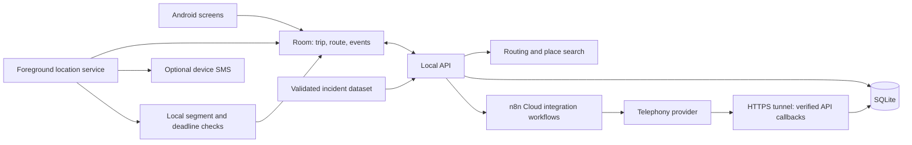

# SheShield rework — implementation plan

> Implementation authorized after plan review. See README.md for the current runnable product and docs/VALIDATION.md for observed acceptance results. This document retains the original audit and design intent.

**Prepared:** 1 October 2026. **Status:** implementation authorized; original audit retained below. Current results and external setup are tracked in `docs/VALIDATION.md`.

**Confirmed by the user:** Kolkata; existing API keys; n8n Cloud on a 15-day trial, with no self-hosted n8n; Twilio previously worked; Pinecone data quality is unknown; no specific judging criteria. These answers supersede the older repository brief's self-hosted n8n assumption.

## 1. Product direction and scope

Build a polished Android journey companion: choose a destination, understand the route trade-off, start monitoring, receive a check-in when appropriate, and see what actually happens when help is requested.

The design direction is **calm, light, map-led, and inspired by iOS**: large titles, grouped cards, rounded bottom sheets, restrained violet accents, precise typography, and subtle motion. Keep native Android permissions, back behavior, notifications, and accessibility.

The strongest demonstration will be one complete journey with visible evidence and recovery from failures. The distinguishing features will be:

1. **“Why this route?”** A short explanation linked to actual incident evidence, source coverage, and the additional walking time.
2. **A journey exposure strip.** A compact representation of the upcoming route segments, linked to highlights on the map.
3. **An honest safety status.** GPS freshness, local monitoring, and contact escalation availability are shown separately when degraded.
4. **An emergency activity timeline.** Show requests, text outcomes, call attempts, and contact acknowledgement as they happen.
5. **A repeatable demo journey.** Replay a realistic walking route through check-in and escalation without sending real messages.

“Ready” means a tested hackathon product on the target emulator and phone, with a working live routing path and a fully disclosed deterministic rehearsal path. It does not imply 24/7 infrastructure or a certified emergency service. This matches the original project brief.

### Confirmed constraints and working assumptions

- Android remains the target; walking is the first supported travel mode.
- Use Kolkata for the bundled scenario. Live planning uses the actual origin and chosen destination.
- Keep the user's existing n8n Cloud trial. Run only the small API locally; use an HTTPS tunnel for cloud-to-laptop callbacks. Do not require self-hosted n8n.
- API keys are available. Verify successful provider requests during implementation; visible OSM map tiles do not establish that ORS directions work.
- Twilio previously worked; verify its current call/callback path early. Mock escalation remains fully functional regardless.
- Complete work in dependency order, with device validation and rehearsal as acceptance checks; the user requested implementation without a day-one/day-two schedule.
- Inspect Pinecone data briefly; if it cannot support geographic scoring, use explicit UNKNOWN coverage in live mode and fictional evidence in rehearsal. Do not make acquiring a new crime dataset a deadline blocker.

## 2. What the audit found

Reviewed both project documents, the original Telegram workflow, all three replacement n8n workflows, the Android screens and layouts, navigation, data/network layers, tracking service, notification/SMS helpers, risk engine, fixtures, Gradle configuration, and existing tests.

The repository is a small Kotlin/XML Android app with Room, Retrofit, MapLibre, and a foreground location service. The backend is exported n8n JSON; there is no independent API or durable shared trip store. Several documented capabilities are intentions rather than implemented behavior.

**Verification boundary:** this was a source audit. Workflow JSON and Android XML parse, and workflow connection targets exist. No app build or live provider execution was performed. In this workspace, Java, the Android SDK, ADB, Node, and npm were unavailable on PATH; `android/local.properties` was absent. Docker's executable exists, but daemon readiness was not tested. Android Studio installation may be on the Windows side and needs checking after review.

### Critical functional defects

Paths below are relative to the repository; `app/` means `android/app/src/main/`.

| ID | Finding and evidence | Consequence | Required fix |
|---|---|---|---|
| F01 | `TripPlanningFragment.kt:72` hardcodes the origin; geocoding failure substitutes a different destination while retaining the typed label. | The app can route somewhere the user did not choose. | Fresh location or explicit origin selection; confirm a geocoded result; never substitute coordinates silently. |
| F02 | `RouteComparisonFragment.kt:72` replaces origin/destination again at Start Trip and uses `route.label` as the destination name. | Route, destination marker, and saved trip disagree. | Persist and carry one immutable trip plan into start. |
| F03 | `TripRepository.kt:42,85` converts routing/start errors into demo routes and invented sessions regardless of demo mode. | A failed backend looks like a successful monitored trip. | Explicit live/demo implementations and typed errors; no implicit mode switch. |
| F04 | Workflow 01's ORS request has no explicit POST method and configures the payload as a field named `=`. It requests `/json`, then treats geometry as coordinate arrays. | Routing request and parsing are incompatible with the intended API. | Explicit POST JSON; consume GeoJSON `features[].geometry.coordinates` and `properties.summary`. See [ORS response formats](https://giscience.github.io/openrouteservice/api-reference/endpoints/directions/requests-and-return-types). |
| F05 | Both demo route builders draw three coordinate points and attach arbitrary distance/duration. | Paths cut across blocks; demo metrics disagree with geometry. | Bundle one validated, road-following route scenario with recorded provider metrics. |
| F06 | Workflow 01's Pinecone node is disconnected and configured as an AI tool; the scoring node still reads its output. | No working incident retrieval path; likely execution failure when that output is accessed. | Validate available data and import/query structured geographic records. |
| F07 | Workflow 02 stores sessions with node-scoped static data, then other nodes read their own node stores; workflow 03 does the same independently. | Heartbeats, check-ins, and SOS cannot reliably retrieve the created session. | One durable API-owned trip store. The current `this.getWorkflowStaticData` usage also needs replacement; current docs use `$getWorkflowStaticData`. [n8n static-data scope](https://docs.n8n.io/build/code-in-n8n/cookbook/built-in-methods-and-variables-examples/getworkflowstaticdata). |
| F08 | The only active-trip risk trigger is `b.demo_trigger === true`; Android has no corresponding request field. No geographic risk-zone check exists. | Walking into a risk segment cannot produce the documented alert. | Cache scored segments and evaluate actual proximity/progress locally. |
| F09 | The expiry timer belongs to `ActiveTripFragment` and is cancelled when its view is destroyed. | Leaving the screen can remove the only timeout mechanism. | Persist deadlines; service-owned local handling plus durable server handling for acknowledged events. |
| F10 | `TripViewModel.triggerSos()` returns immediately without an active trip. | Home SOS opens a screen but initiates no alert. | Standalone SOS incident/session independent of trip existence. |
| F11 | `SosFragment.kt:57` says SMS was sent based solely on the contact list; `SmsHelper` supplies no sent/delivery callbacks. | The UI asserts success without evidence. | Per-contact status from actual provider/device results. |
| F12 | SOS awaits location and the backend before device SMS; missing location becomes `0,0`. | Slow network delays texts; bad location can be shared as valid. | Independent delivery channels and a fresh/stale/unavailable location model. |
| F13 | SOS validation calculates `validated` but never gates escalation; error responses generally use HTTP 200. | Unauthorized or failed operations appear successful. | Enforce authentication and return structured errors with correct status codes. |
| F14 | Twilio status handling computes `should_escalate` but has no downstream escalation action or persisted deduplication. | No working second-contact chain. | Durable call attempts, callback validation, contact progression, and duplicate suppression. |
| F15 | `endTrip()` updates local state only after the network call; notification “End Trip” merely stops the service. | Trips can remain active after tracking stops. | One local end operation used from every entry point, with queued backend synchronization. |

### Reliability, UI, and evidence gaps

| ID | Finding and evidence | Required fix |
|---|---|---|
| F16 | Route geometry lives only in `TripViewModel.plannedRoutes`; Room stores only the route ID. | Persist the selected geometry, route revision, endpoints, metrics, and risk segments. |
| F17 | After the first draw, every active-trip update can animate the camera to the destination; `routeDrawn` is not reset for a new view. | Map renderer with explicit overview/follow/free-pan modes and lifecycle-safe restoration. |
| F18 | `START_STICKY` does not restore on a null intent; notification actions depend on in-memory IDs; boot receiver launches an unmanaged coroutine and assumes service start is allowed. | Restore from Room; include stable action IDs; use permission-aware recovery and a resume notification when necessary. |
| F19 | Location fixes worse than 50 m are dropped without user-visible degradation. | Track accuracy and age separately; show uncertainty and suppress unreliable segment transitions. |
| F20 | No real onboarding, route-preview map, ETA/progress, arrival screen, history screen, contact edit/delete/reorder, or useful settings/readiness view. | Implement these in the screen plan below. |
| F21 | Shared replayed `UiState` drives navigation; route card selection starts at `-1`, differs from the auto-selected route, and calls `notifyItemChanged(-1)`. | Screen-specific state, guarded navigation events, and stable route selection. |
| F22 | Empty/missing incident data is scored LOW; scoring uses distance to vertices, mishandles `days_old=0`, rejects valid zero coordinates, and lacks robust date validation. | Coverage-aware UNKNOWN, distance to line segments, null-safe normalization, validated dates, and direct engine tests. |
| F23 | Risk is displayed as a percentage; recommendation labels are assigned before sorting; route summaries invent lighting/footfall context. | Exposure index rather than probability; assign labels after ranking; generate copy from available evidence only. |
| F24 | Tests contain a separate Kotlin copy of the scoring algorithm, not the shipped JS implementation. Docs say nine tests; the file contains fourteen. | Test the production engine directly and test Kotlin segment checks separately. |
| F25 | The setup guide describes local Community Edition while the user actually uses n8n Cloud. It also relies on plan-dependent `$vars`, reproduces secrets, embeds an ORS key in BuildConfig, and enables sensitive debug BODY logging. | Document the actual Cloud trial setup, use credentials instead of assuming variable availability, move secrets server-side, and redact logs/docs. [n8n variable availability](https://docs.n8n.io/build/code-in-n8n/define-custom-variables.md). |

The original `SheShield.json` also confirms the older Telegram design: an LLM-derived risk label, a MEDIUM-only alert branch, polling the first Telegram update for “Yes,” and timed calls without trip-scoped acknowledgement. Preserve it as historical reference; the redesigned app should not depend on it.

## 3. Architecture decisions

### Keep the Android foundation; rebuild presentation and state handling

Retain Kotlin, Fragments/XML, Navigation, Room, Retrofit, and MapLibre. Six existing screens do not require a framework migration to achieve the requested design. Use shared styles/components, `CoordinatorLayout`/bottom sheets, and a reusable map renderer. Split the activity-wide ViewModel into planning, active-trip, contacts, and SOS state holders as those flows are rebuilt.

Use Room as the source of local trip state and Kotlin flows for observation. Add small injectable interfaces for location, API, clock, and alert delivery so real behavior can be tested. Keep a single Android module and a simple application container.

### Add one small local API with SQLite

Proposed implementation: TypeScript + Fastify + SQLite in one local service, with a Docker run path so a separate host Node installation is optional. Pin compatible versions when implementing. This service owns plans, sessions, authenticated commands, risk calculation, deadlines, and escalation records. SQLite transactions provide a concrete place to reject duplicate events and serialize state changes.

Use the existing **n8n Cloud** instance for provider orchestration and optional data ingestion/explanation. It reads and updates state through authenticated API worker endpoints rather than keeping copies in workflow static data. This adds one local process but removes cross-workflow state ambiguity and makes the critical logic directly testable. Keep the laptop awake for the demo.

The local API calls an authenticated production n8n Cloud webhook for delivery jobs. Cloud n8n and Twilio reach the API's allowlisted worker/callback routes through an HTTPS tunnel. Android uses the local API via emulator host access or ADB reverse. Configure one public callback base URL, check it before rehearsal, and handle tunnel changes explicitly. Cloud n8n cannot call the laptop's `localhost` or `10.0.2.2`.



Keep routing on the direct API path to simplify validation, caching, and timeout behavior. For the two-day build, replace workflow 03 with a working integration worker and document workflows 01/02 as superseded by API endpoints; do not spend time maintaining unused compatibility adapters. Preserve their exports for reference. There must be one implementation of business rules.

### Explicit operating modes

| Mode | Routing and data | Tracking | Alerts |
|---|---|---|---|
| Live | Provider route; validated incident dataset or explicit unknown coverage | Device GPS | Configured real channels with observed status |
| Practice | Real provider route for selected endpoints, validated incidents or unknown coverage | Simulated route replay through the same location interface | Simulated channel adapter; no SMS or real calls |
| Explicit recorded demo | Bundled Kolkata route, fictional incidents, fixed evaluation date | Simulated route replay through the same location interface | Simulated channel adapter; no SMS or real calls |
| Degraded live trip | Previously selected route/segments remain available | Local monitoring continues where the OS and permissions allow | Show exactly which channels remain available; queue eligible events |

Mode is persisted with the trip and enforced at every delivery boundary. Rehearsal cannot accidentally use live adapters. Switching mode ends/resets the current rehearsal; it cannot reinterpret a live trip. No provider failure silently creates a simulated session.

## 4. Visual and interaction specification

### Design system

| Element | Specification |
|---|---|
| Base surfaces | Light background `#F5F5F8`, white cards, hairline separators `#E7E7ED` |
| Text | Primary `#171821`; secondary `#666875`; use native sans-serif with consistent weights |
| Brand | Violet `#6554D9`; pale violet selection `#EEEBFF`; red reserved for SOS/error |
| Status | Teal for monitoring, amber for check-in, red for SOS, gray for unknown data; always pair color with text/icon |
| Typography | Large title 32 sp, screen title 24 sp, card title 18 sp, body 16 sp, metadata 13 sp; system font scaling supported |
| Spacing | 4/8/12/16/24/32 dp scale; 20 dp screen margins |
| Shape | 20–24 dp card corners; 28 dp bottom-sheet top corners; pill status chips |
| Controls | 52–56 dp primary buttons; at least 48 dp interactive targets; 60–64 dp SOS control |
| Icons | Consistent vector line icons; replace emoji and old system menu icons |
| Motion | 180–250 ms transitions; gentle sheet movement and selection feedback; respect reduced animations |
| System integration | Edge-to-edge layout with correct insets, keyboard avoidance, gesture navigation, Android back behavior |
| Dark mode | Matching semantic tokens in `values-night`; no fixed purple background across the app |

Use an opaque light bottom sheet with a subtle shadow for consistent rendering; translucency is optional polish only when legibility and device performance permit. Keep map attribution visible above/beside sheet bounds.

### Screen-by-screen behavior

| Screen | Layout and primary content | Required states and interactions |
|---|---|---|
| Welcome/setup | Small shield mark; “A little more confidence on your way”; short explanation; contact setup card | Ask location when “Use my location” is selected; notification explanation before trip alerts; continue with limited features if denied; no permission barrage |
| Home / Journey | Large “Where to?” title, origin chip, destination search card, recent destinations, compact readiness card, resumable trip card | Current/stale/unavailable location; contact count; one clear start action; persistent SOS access; bottom tabs Journey / Circle, settings from header; Activity and saved places are optional |
| Destination search | Editable From/To rows, search results with locality, recent places, “Choose on map” | Explicit result selection; loading/empty/error; GPS origin, manually selected origin, or map pin; never accept ambiguous text as a confirmed destination |
| Route preview | Map in upper/full area; draggable comparison sheet; selected route emphasized; other routes muted | One to three genuine alternatives; tap card/polyline to select; walking time and distance; “+N min” computed from actual durations; evidence sheet; sticky Start Journey |
| Evidence detail | “Why this route?” heading; segment highlight; concise structured explanation | Incident count, corridor distance, period, source, evaluation date, coverage; distinguish fictional data and unknown coverage; avoid probability percentages |
| Active journey | Follow map, remaining distance/estimated time, journey exposure strip, compact monitoring card | Overview/recenter controls; free pan; offline/GPS-stale state; SOS; end/arrival action; maneuver guidance and rerouting follow only after core acceptance |
| Check-in | Prominent rounded sheet with calm copy, countdown ring, large “I'm safe,” separate SOS | Trigger reason and affected segment; notification mirrors state; immediate local acknowledgement with visible sync status; persistent deadline |
| SOS | Restrained red header, location with age, contact activity timeline, emergency dial action | Works with or without trip; requesting/sent/delivery unknown/failed/calling/acknowledged states; cancel future escalation with explicit result; retry only failed eligible channels |
| Circle | Contact cards with initials, name, masked secondary phone display, priority order | Add/edit/delete/reorder, phone normalization, duplicate prevention, empty state; changes apply to new trips unless user explicitly updates active recipients |
| Arrival / Activity | “You've arrived” screen and compact journey summary; history list is optional | User confirms arrival; tracking stops; duration/distance/check-ins; no endless raw coordinate trail |
| Settings | Appearance, permission/readiness links, privacy/reset, rehearsal entry | Developer connection details live in a debug section; ordinary product screens describe impact and recovery actions |

### Layout sketches

```text
JOURNEY                     ROUTE PREVIEW                ACTIVE JOURNEY
SheShield            [SOS]  [‹] Victoria Memorial [SOS]  [‹] Your journey      [SOS]
Where to?                  ┌─────────────────────────┐ ┌─────────────────────────┐
[Current location      ▾]  │                         │ │  Next: turn left        │
[Search destination     ]  │    route alternatives   │ │                         │
[Home] [Work]              │      on the map         │ │    route + position     │
                          │                    [◎]  │ │                    [◎]  │
┌───────────────────────┐ ├─────────────────────────┤ ├─────────────────────────┤
│ Ready for your walk   │ │ Choose your route       │ │ 12 min       0.8 km     │
│ Location available    │ │ ● Lower exposure        │ │ ━━━━╸················  │
│ 2 trusted contacts    │ │   24 min · 1.8 km        │ │ Monitoring · updated now│
└───────────────────────┘ │   +4 min · Why?          │ │ [Share] [End journey]   │
Recent destinations       │ ○ Fastest · 20 min       │ └─────────────────────────┘
                          │ [Start journey         ] │
Journey      Circle       └─────────────────────────┘
```

Numbers in these sketches illustrate layout only. Production copy is computed from the selected route. “Share” opens the system share sheet for destination, ETA estimate, and a timestamped location link; continuous web tracking is optional later scope.

## 5. Data and API contracts to implement

Store these concepts explicitly:

- **TripPlan:** plan ID, immutable origin/destination with labels, selected travel mode, route options, expiration, provider attribution, route-data provenance, risk-data provenance, and evaluation time.
- **Route:** ID/revision, `[longitude, latitude]` geometry at the wire boundary, meters/seconds, maneuver steps, scored segments, coverage status, evidence IDs, algorithm version, recommendation reason.
- **Trip:** ID, selected plan/route revision, lifecycle state, monitoring state, last fix with accuracy/age, contact snapshot, timestamps, sync state.
- **CheckInEvent:** event ID, trip/revision, trigger, created time, deadline, resolution, state version. One unresolved event per trip.
- **SosIncident:** independent incident ID, optional trip ID, trigger `MANUAL` or `TIMEOUT`, location snapshot, recipients, cancellation state.
- **DeliveryAttempt:** incident/contact/channel, attempt ID, provider ID, requested/sent/delivered/failed status, timestamps, retry eligibility. Voice and SMS use their own status vocabulary.
- **OutboxEvent:** stable event ID, sequence, payload version, expiry, acknowledged time. Coalesce location uploads; retain ordered lifecycle changes.

Room migration must preserve existing contacts and recoverable trip data. An old trip without geometry gets an explicit “Route needs to be restored” state. Remove destructive migration as the default.

### Proposed public API

Use `/v1` endpoints, JSON schema validation, UTC timestamps, meters/seconds, and a documented error envelope `{code, message, retryable, request_id}`. Resource reads also require authorization.

| Endpoint | Purpose / important behavior |
|---|---|
| `GET /health`, `GET /ready` | Process health separately from routing, data, storage, and alert adapter readiness |
| `POST /v1/sessions` | Issue a random installation session token; local-demo enrollment restricted to the configured environment; rate-limit creation |
| `GET /v1/places?q=...` | Explicit submitted place search, locality bias, bounded results, caching |
| `POST /v1/plans` | Validated endpoints/mode → routes, provenance, evidence/coverage, expiry |
| `POST /v1/trips` | Create from owned plan + selected route + contact snapshot; idempotency key prevents duplicate starts |
| `GET /v1/trips/{id}` | Restore authoritative lifecycle, route revision, check-ins, incident/channel states |
| `POST /v1/trips/{id}/locations` | Timestamped fix + sequence; ignore stale/out-of-order fixes; return current state/version |
| `POST /v1/trips/{id}/check-ins` | Register local geographic trigger with stable event ID and deadline |
| `POST /v1/trips/{id}/check-ins/{eventId}/resolve` | SAFE or SOS; compare current event/version; reject stale acknowledgements |
| `POST /v1/trips/{id}/reroute` (optional) | Recalculate from valid current position to the original destination; replace only after user accepts |
| `POST /v1/trips/{id}/end` | Idempotent completed/cancelled transition; cancel pending events and future escalation |
| `POST /v1/sos` | Create standalone or trip-linked incident; idempotency key; no mandatory reverse-geocoding dependency |
| `GET /v1/sos/{id}`, `POST /v1/sos/{id}/cancel` | Observe results; cancel future attempts without claiming already-sent messages were recalled |
| `POST /v1/provider/twilio/status` | Validate provider signature, associate callback with attempt, deduplicate and apply allowed transitions |
| Internal worker endpoints | Authenticated claim/result operations for n8n delivery jobs; never trust contact numbers from callbacks |

Keep provider credentials on the server/n8n. Tokens should be cryptographically random, scoped, expiring, and stored securely on Android; never use `Math.random()` session secrets. Restrict the public tunnel to required callback routes and do not expose the n8n editor through it.

## 6. Routing and risk implementation

### Routing

1. Resolve origin with a timeout and freshness check; allow explicit manual origin for preview. Starting monitored travel requires a usable location or a clearly limited state.
2. Submit place search through one provider adapter. Prefer the existing ORS account's geocoding if available; otherwise explicit Nominatim searches through a cached, throttled server adapter. Do not use public Nominatim for per-keystroke autocomplete. [Nominatim usage policy](https://operations.osmfoundation.org/policies/nominatim/).
3. Call ORS's walking GeoJSON endpoint using an explicit POST body and server-side key. Normalize geometry once at the API boundary.
4. Validate finite/range-correct coordinates, at least two distinct points, geometry type, positive metrics, and endpoint proximity. Handle snapped endpoints and inaccessible destinations visibly.
5. Request genuine alternatives, deduplicate effectively identical routes, and accept a one-route response. Never manufacture alternatives with coordinate offsets.
6. Compute fastest and lower-exposure recommendations after scoring; calculate time differences numerically. If coverage is unknown, recommend by travel time and explain the missing comparison.
7. Use GeoJSON sources and line/symbol layers in MapLibre. Draw alternatives, selected-route casing, segment overlays, endpoints, and a current-location accuracy circle. Keep selection color distinct from exposure status.
8. Fit camera once per route selection with sheet-aware padding. Recenter follows the user; dragging exits follow mode. Restore overlays after style reload/view recreation.
9. Estimate remaining distance along the route. Derive ETA from remaining route/provider duration and observed walking progress; label it as estimated. Detect sustained off-route fixes before offering recalculation.
10. Detect arrival using proximity plus several good fixes/dwell, then request confirmation; passing near a destination must not silently end monitoring.

Retain the working OSM raster basemap initially, with correct attribution, application identification, and normal HTTP caching. A lighter vector style is optional once routing works. Do not bulk-prefetch public OSM tiles for rehearsal; if tiles fail, retain the route/status UI and show a map-unavailable state. The bundled route is offline-capable geometry, not a promise of an offline street basemap. [OSM tile usage policy](https://operations.osmfoundation.org/policies/tiles/).

Initial tunable walking values: fresh origin within 30 seconds; show a stale-location state after 60 seconds; segment entry requires consecutive reliable fixes; deviation roughly 60 m for three fixes; arrival roughly 40 m for 15 seconds. Validate these against real GPS accuracy and the demo route before finalizing.

### Incident data and scoring

Inspect a sample of the actual Pinecone dataset before enabling live reported-risk claims. Verify coordinates, dates, IDs, categories, geographic granularity, source, licensing/availability, and coverage. The repository currently contains only explicitly fictional incident records; external data quality is unverified.

Import usable incident records into a small SQLite table with bounding-box filtering. Start with a validated JSON import; add a Pinecone importer only if the sample data qualifies and access is straightforward. Limit the initial data investigation to roughly one hour. Do not treat a semantic top-20 result as a complete geographic neighborhood. Aggregate district statistics can be shown as regional context; they cannot color individual streets as if they were precise incidents.

Implement one production JS/TS risk engine, reusing and correcting `n8n/risk_engine.js` or moving it into the API package. Android consumes precomputed segment scores; it only implements geographic membership/progress, avoiding a second scoring implementation.

- Compute distance to route **segments**, not just sampled vertices. Deduplicate incidents by stable source ID.
- Validate zero coordinates, missing dates, invalid/future dates, category normalization, and absent geometry.
- Retain severity × recency × distance weighting as a transparent heuristic, with versioned parameters. Initially keep 500 m corridor, 60-day half-life, and 300 m distance sigma; validate thresholds with fixed examples before using alert labels.
- Produce both segment exposure and a distance-weighted route exposure summary, with a separate elevated-segment flag. Count an incident once in route evidence even if it influences multiple segments.
- Store an explicit coverage state: `AVAILABLE`, `INSUFFICIENT`, or `UNAVAILABLE`. Zero matches is LOW only when the available dataset supports that interpretation; failed retrieval or missing coverage is UNKNOWN.
- Present an exposure index and evidence, never a probability of crime. Do not imply the heuristic has predictive calibration.
- Use the same evaluation timestamp and version across alternatives. Rehearsal uses a fixed clock so scores do not decay between rehearsals.
- Only cite lighting, footfall, time-of-day, or other context if a real source supplies it. Default explanations are deterministic templates.

## 7. Monitoring, check-ins, and emergency behavior

### Lifecycle rules

```text
PLANNED → STARTING → ACTIVE → COMPLETED / CANCELLED
                       ↓
                CHECK_IN_PENDING → ACTIVE (safe acknowledgement)
                       ↓
                   SOS_ACTIVE → RESOLVED / CANCELLED

Manual SOS can create a standalone incident from any app screen.
Monitoring quality and network sync are separate from trip lifecycle.
```

Only one trip can be active for an installation. Every command carries stable IDs; callbacks cannot resurrect a completed trip or resolve a different check-in.

### Tracking and deadline ownership

- Start the location foreground service from the visible user action after permission checks. Android allows continued location use for an appropriately started service; permission/background-start rules must be tested on the target OS. Use a resume notification when automatic recovery is disallowed. [Android permission guidance](https://developer.android.com/training/permissions/requesting), [background service-start restrictions](https://developer.android.com/develop/background-work/services/fgs/restrictions-bg-start).
- Request updates around every 5–10 seconds while walking and throttle backend heartbeats around 30 seconds, with immediate lifecycle/event uploads. Tune with device battery measurements.
- Persist each valid fix locally before networking. Use location timestamps/accuracy to detect stale or unreliable fixes. Do not silently represent bad GPS as active precise monitoring.
- Evaluate cached risk segments locally, with entry/exit hysteresis and a cooldown so boundary jitter does not create repeated warnings. Suppress new risk prompts during SOS.
- Save a check-in event and deadline before showing it. The screen only renders remaining time; the foreground service owns local expiration. Restore unresolved events on service/app recreation.
- The API persists acknowledged deadlines and runs a restart-safe due-event worker. The app and server use the same event ID to prevent duplicate remote escalation. A local-only event cannot acquire server protection until it is uploaded.
- “I'm safe” immediately resolves the local event and cancels the local timer. If offline, show “Saved on this phone; confirmation pending.” A remote deadline already acknowledged by the server may still expire; do not claim the server cancelled until it confirms. On reconnection, reconcile ordered events and show any escalation already attempted.
- Use monotonic elapsed time while the process/device session is alive and persisted wall-clock/server references for recovery; handle expired deadlines and clock changes explicitly.
- Reopening, rotating, or leaving the screen must never create a new deadline. Force-stop and power-off recovery are explicit limitations; do not promise execution when the OS prevents it.
- End-trip from the screen, notification, arrival, or cancellation uses the same coordinator: mark ended locally, stop tracking and prompts, invalidate pending jobs, then synchronize with bounded retries.

### SOS and delivery rules

1. Activate manual SOS with a short hold and haptic feedback; provide a visible accessible tap-and-confirm alternative. Emergency dial remains immediately available.
2. Create/persist the incident first. Use the latest acceptable location with age/accuracy; if unavailable, send the alert without fabricated coordinates.
3. Start configured device-SMS and remote-call paths independently. Reverse geocoding enriches an alert but cannot block it.
4. Default rehearsal always uses mock contacts and delivery. Real device SMS is opt-in, requires permission/SIM, and tracks sent/delivered callbacks where supported; unavailable delivery receipts remain unknown. Offer the SMS composer when direct sending is unavailable.
5. n8n claims a delivery job, requests the call, and records the provider call ID. The API validates callbacks and controls which attempt comes next. Retry timeouts with uncertain provider outcome only after reconciliation, to avoid duplicate calls.
6. Advance to the next contact after configured failure/no-answer/busy or missing acknowledgement, with a bounded retry budget. Cancellation prevents future attempts. Duplicate/out-of-order callbacks cannot advance twice.
7. Distinguish an answered call from a person accepting responsibility. Twilio documents that a completed call can be voicemail/IVR. Include an explicit “press 1 to acknowledge” path if supported; otherwise show “Call completed; acknowledgement unconfirmed.” [Twilio call states](https://www.twilio.com/docs/voice/api/call-resource).
8. Show truthful state in the SOS timeline. Replace “Help is on the way” with the observed event, such as “Calling your first contact.”
9. Keep the native emergency dialer action; configure the country/number for the demo location. Do not route emergency-service calls through Twilio.

## 8. Implementation sequence and acceptance gates

Implement in this order after review. Each milestone should leave a runnable checkpoint. M0–M8 are work packages inside the two-day window, not permission to expand scope. Optional additions follow only after the core gates pass.

### Execution order

The user subsequently authorized full implementation without a day-by-day schedule. The dependency sequence below is retained; the former timed schedule has been superseded. Current implemented behavior and verification are recorded in `SHE_SHIELD_MASTER.md` and `docs/VALIDATION.md`.

### M0 — Reproducible baseline and configuration

**Changes:** Gradle/configuration, `android/local.properties.template`, `.gitignore`, API Dockerfile/local run configuration, API package skeleton, sanitized setup docs, environment templates, setup diagnostic scripts.

- Confirm whether Android Studio/SDK run on Windows or Linux; document one build path and correct SDK path syntax. Start with the existing compatible Gradle/AGP/Kotlin baseline; change versions only for a demonstrated need.
- Build the existing app and record actual compile/lint/runtime failures before replacing screens.
- Add a container/run command for the local API with persistent SQLite storage. Keep n8n on the user's Cloud trial. Configure the HTTPS callback tunnel and test Cloud-to-API reachability. Configure emulator host and phone ADB-reverse URLs separately; a physical phone does not use emulator `10.0.2.2`.
- Remove the unused APK ORS secret field; configure server routing credentials and n8n Cloud credentials without depending on optional custom-variable features.
- Redact active docs/logs, exclude sensitive state from Android backup, and limit local cleartext access to debug configuration. Preserve a private original workflow reference before sanitizing any distributable copy. Flag the exposed bot token for owner rotation without reproducing it.

**Gate:** Android installs; API health responds; n8n Cloud production webhook and callback tunnel are reachable; configuration validation distinguishes missing providers; no credentials are printed or embedded in the APK.

### M1 — Contracts, persistence, and explicit demo path

**Changes:** `api/src/{routes,db,domain,adapters}`, `api/openapi.yaml`, Android `TripModels.kt`, `TripDao.kt`, `AppDatabase.kt`, repositories/ViewModels, `demo/` scenario manifest.

- Implement validated API contracts, auth, migrations, lifecycle transition reducer, event idempotency, and plan ownership.
- Persist route/plan/contact snapshot and pending events in Room and SQLite.
- Replace fallback-success behavior with typed errors and an explicit rehearsal adapter. Build a full local rehearsal lifecycle early, before relying on external services.
- Add fixtures and contract tests covering success, error, missing fields, invalid geometry, duplicate starts, and stale events.

**Gate:** A recorded route survives app recreation; live API failure returns an actionable error; rehearsal starts/ends without network; duplicate commands have one effect.

### M2 — Real place search, routing, and map correctness

**Changes:** API routing/geocoding adapters; `TripPlanningFragment`, `RouteComparisonFragment`, `ActiveTripFragment`; new `LocationProvider`, `TripPlanRepository`, and `RouteMapRenderer`.

- Implement explicit From/To selection, fresh origin, pin fallback, correctly parsed ORS geometry, genuine alternatives, caching, and endpoint validation.
- Fix destination/label propagation and map lifecycle/camera behavior; persist every selected route revision.
- Prepare the bundled road-following scenario with attribution/provenance and realistic metrics.

**Gate:** Choose two distinct real destinations and verify the correct road-following path, final marker, label, and metrics each time. Route selection updates the map. Rotation and restart restore the selected path. Test a one-route response and provider failure.

### M3 — Design system and complete screen redesign

**Changes:** `res/values`, `values-night`, vector drawables, shared card/button/input styles, all existing layouts, navigation shell; compact onboarding, evidence, completion, and settings sheets. Activity/history is optional.

- Apply the design tokens and layouts in section 4; remove emoji-driven UI and redundant toolbar chrome.
- Build the map/bottom-sheet interaction, route cards, evidence detail, contact editor, readiness states, and reusable loading/error/empty views.
- Replace activity-wide navigation state with scoped ViewModels and deliberate one-time navigation.
- Keep all displayed content connected to repositories; mock content appears only through the rehearsal adapter.

**Gate:** Capture screenshots of every screen in light/dark mode; review on a small device and at large font scale. Verify contrast, TalkBack labels, touch targets, keyboard/insets, back stack, and that every visible action works.

### M4 — Real evidence and segment-triggered check-ins

**Changes:** risk engine module/tests, incident import/validation, route scoring API, local segment monitor, cached evidence models, exposure strip/evidence UI.

- Inspect available live data; choose eligible source adapter or expose UNKNOWN coverage.
- Implement segment-distance scoring, validation, deduplication, ranking and coverage rules.
- Connect the same segment IDs to map overlays, exposure strip, and check-in events.
- Use a fixed-clock synthetic scenario to trigger the full flow even if live data cannot support it.

**Gate:** A replay entering a configured segment triggers one event; repeated boundary fixes do not spam; empty/unavailable datasets do not appear safe; score explanations reproduce the production engine output.

### M5 — Tracking and lifecycle reliability

**Changes:** `TripTrackingService`, `BootReceiver`, notification actions/deep links, new trip/check-in coordinator, connectivity observer/outbox, arrival/progress logic.

- Implement background tracking, persisted deadline handling, notification actions, state reconciliation, progress and deviation handling.
- Add API deadline worker and transactional check-in resolution. Restore pending events and queued actions after restarts.
- Make end-trip immediate locally, then synchronize; handle permissions revoked mid-trip and denied service starts visibly.

**Gate:** Check-in expiry still works after navigating away and locking the screen; notification “I'm safe” resolves the right event; offline ending stops tracking immediately; app recreation restores route/deadline; force-stop/reboot behavior matches documented limitations.

### M6 — Standalone SOS and working contact escalation

**Changes:** `SosFragment`, `SmsHelper`, incident/delivery tables, callback endpoint, internal worker endpoints, rewritten n8n integration workflows.

- Implement standalone SOS, channel status, permission-aware SMS, independent remote delivery, cancellation, and ordered contacts.
- Verify real provider configuration and callback signatures; handle duplicates, delayed callbacks, unknown outcomes, and no-answer escalation. Keep the public callback URL correct through the tunnel.
- Add import/publish instructions and readiness checks for the user's n8n Cloud instance; record its version and distinguish test webhook URLs from production webhook URLs.

**Gate:** Home SOS works without a trip. Mock scenario progresses through first-contact failure to second-contact acknowledgement exactly once. GPS/backend/reverse-geocoding failures do not block available channels. Real calls/SMS are separately exercised with the user's designated test recipient when configured.

### M7 — Demo polish and product completion

**Changes:** `demo/scenarios`, replay controls, debug readiness screen, completion/activity screens, share intent, demo script and reset tooling.

- Add replay/pause/reset, normal-speed and accelerated check-ins, network/GPS failure injection, and per-channel simulated outcomes.
- Show persistent rehearsal labeling and keep reset scoped to rehearsal records.
- Finish arrival summary, tasteful motion/haptics, and contextual copy. Add history/saved places only if the feature-freeze gate allows it.
- Add a setup diagnostic that explains missing API keys, dataset coverage, device permission, and alert availability without exposing secrets.

**Gate:** A complete three-minute scenario runs repeatedly without a real SMS/call. A judge can see the route trade-off, evidence, check-in, escalation, and recovery without opening developer tools.

### M8 — Device validation and handoff

**Changes:** focused unit/integration/instrumentation tests, updated `SHE_SHIELD_MASTER.md`, n8n import checklist, build/run scripts, known-limits and demo checklists.

- Run Kotlin unit tests, lint, API/risk integration tests, instrumentation, and the device matrix below.
- Build a reproducible debug APK, identify its configuration, and document exact local startup/emulator/phone steps.
- Rehearse three successful runs plus one deliberate provider/network failure. Capture final screenshots and a backup demo recording.
- Rewrite master docs around implemented and verified behavior, with real/mocked/unverified provider status separated.

**Gate:** All required acceptance tests pass; remaining limitations are documented with reproduction and user-visible behavior. No placeholder success states remain in the core journey.

## 9. Validation matrix

| Area | Required checks |
|---|---|
| Production risk engine | Zero valid incidents with/without coverage; midpoint-near incident far from vertices; duplicate IDs; day zero; zero coordinates; invalid/future dates; severity/recency; threshold boundaries; deterministic clock; stable ranking |
| Routing/API | ORS GeoJSON fixtures; lng/lat inversion; invalid/empty geometry; inaccessible endpoints; one/multiple routes; provider timeout/429/auth failure; ownership; expired plan; idempotency |
| State machine | Duplicate start/SOS; SAFE vs timeout race; end vs SOS race; delayed location; duplicate/out-of-order callback; app/server restart; invalid token; second active trip |
| Outbox/offline | Backend loss while tracking; SAFE while offline; expired unsent event; end while offline; reconnect order; no replayed alert after cancellation; bounded retry/backoff |
| Android service | Fresh/approximate/denied/revoked location; notification denied; cold start from notification; null-intent restart; screen lock; rotation; app swipe-away; reboot recovery; force-stop limitation |
| Maps/UI | Select alternative; pan/recenter; style reload; view recreation; route restore; route deviation; arrival near parallel road; empty/error/loading; large text; light/dark; TalkBack; keyboard/insets |
| Delivery | No contacts; invalid/duplicate phone; missing SIM/SMS permission; multipart outcomes; remote timeout; geocoder failure; first contact busy; callback signature rejection; voicemail vs acknowledgement; cancel chain |
| Mode isolation | Rehearsal cannot reach real SMS/call adapters; mode survives restart; demo reset cannot delete live data; unconfigured live provider never becomes mock success |

Prioritize Android checks on API 34 and the intended physical demo phone. Broaden to a recent emulator image only if time remains after the required gates. Use emulator route replay for GPS scenarios and a physical SIM-capable phone for actual SMS. Measure responsiveness and battery behavior during a sustained walking/replay session, not just a screenshot launch.

## 10. Hackathon demo and scope control

### Three-minute presentation

1. **0:00–0:25:** Open the redesigned home, show two trusted contacts, choose a destination.
2. **0:25–0:55:** Compare routes. Tap “Why this route?” and show the exact time trade-off and evidence coverage.
3. **0:55–1:25:** Start the journey; replay moves along the actual path. Show location age, progress, and upcoming exposure.
4. **1:25–1:50:** Enter a configured segment; check-in appears. Confirm safe once to demonstrate immediate recovery.
5. **1:50–2:30:** Trigger the next rehearsal check-in and let its shortened deadline expire. Show the first contact unavailable, the next contact acknowledging, and a timestamped location.
6. **2:30–3:00:** Finish the trip, show arrival summary, and briefly explain live versus simulated parts.

The shortened timer, fictional incidents, simulated location, and mock delivery are visibly labeled. A separate live segment demonstrates actual routing/GPS and, if configured and rehearsed with a consenting test recipient, one real delivery.

### Priority cuts if time is short

**Protect:** routing correctness, explicit mode separation, map preview, core visual redesign, working check-in/deadline behavior, standalone SOS, truthful delivery state, contacts, and repeatable demo.

**Finish next:** rerouting, arrival refinement, history, saved places, extended dark-mode polish, and richer transitions.

**Optional after core acceptance:** expiring read-only live trip link; evidence-bound AI explanation with deterministic fallback; richer help-location data from a verified source; additional travel modes.

Do not add social feeds, unverified “safe place” badges, crime prediction claims, a conversational chatbot in the emergency path, or continuous microphone monitoring. These consume time without making this journey demonstrably work.

## 11. Review decisions and remaining inputs

The proposed defaults are ready for implementation: native Kotlin/XML, light iOS-inspired UI, a small local API plus SQLite, the existing n8n Cloud trial for integrations, walking-first routes, and a clearly labeled Kolkata rehearsal scenario. The deadline is two days and no specific judging criteria were supplied.

There are no unanswered product questions blocking this plan. Android Studio/device readiness, actual ORS calls, Cloud webhook configuration, Twilio callbacks, and Pinecone data quality are implementation checks in M0/M4. No secret values are needed in conversation.

**Stop point:** review this plan before implementation. No application code, dependencies, workflows, or deployed services have been changed in this planning pass.
